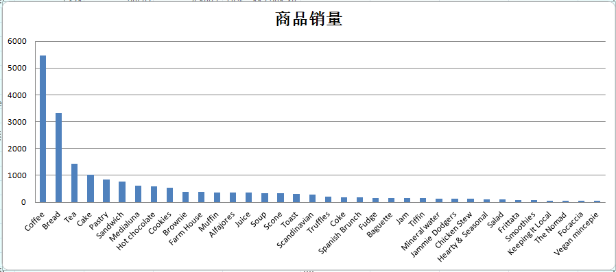
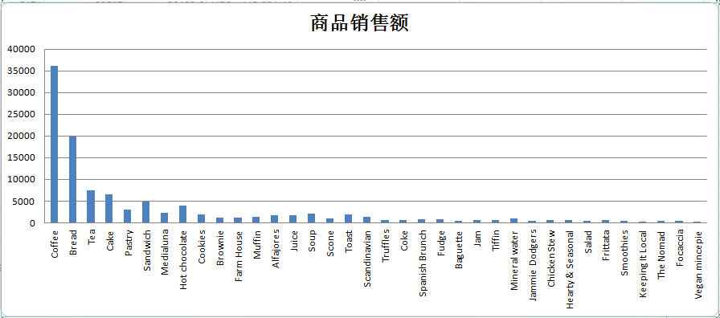
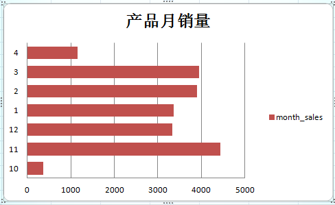
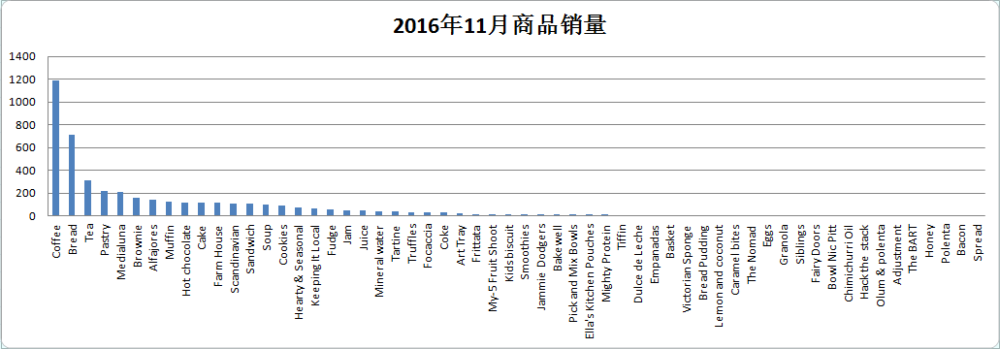
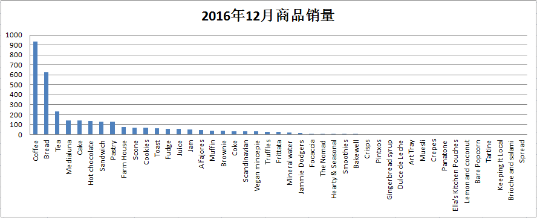
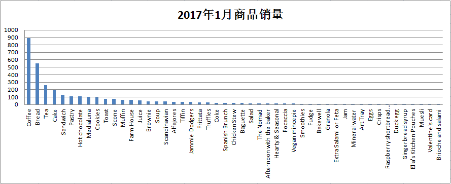
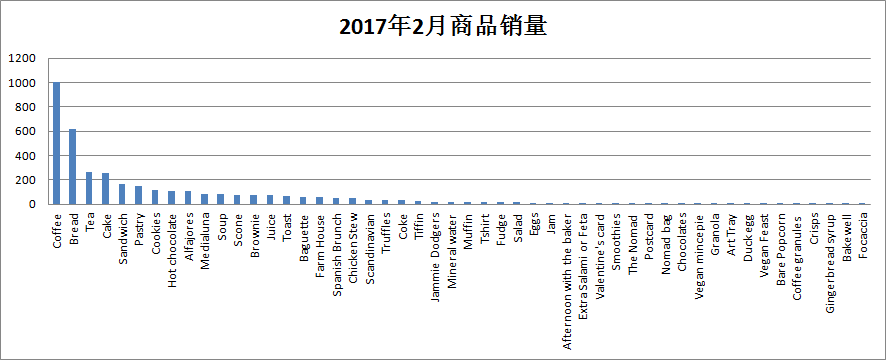
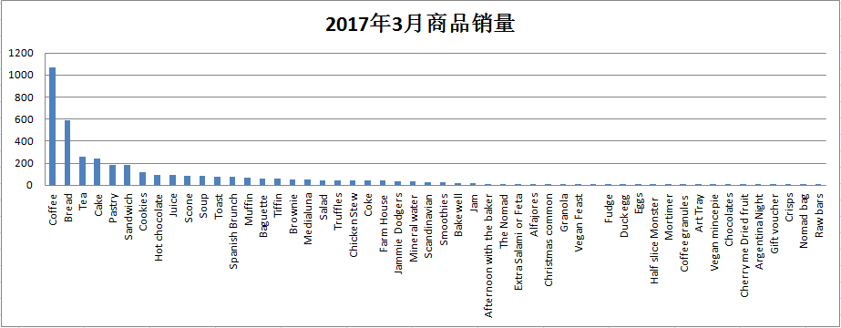
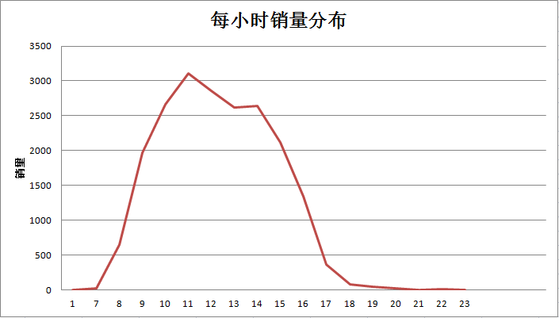

# 网红咖啡店的商业决策

这篇分析报告是为某网红咖啡店的运营给出的咨询建议，整篇报告将按照标准的CRISP-DM分析框架进行分析。具体包含六个部分：

1. 业务问题
2. 数据理解和准备
3. 分析和建模
4. 建议的决策

## 一. 业务问题

这篇分析报告要集中回答的一个核心业务问题是：如何给这家咖啡厅制定适合它自身特色的经营策略，以便在未来得到更好的发展？

要回答这样的问题，我们要做出的决策包括：
1. 咖啡厅是否可以在不同的月份推出不同的热销产品？
2. 咖啡厅是否可以在每天不同时段推出不同的产品和服务？
3. 咖啡厅是不是可以推出热卖商品的套餐组合？

要支持上面的决策，需要了解如下信息：
1. 不同商品的总销售额和销量
2. 每月商品总销量
3. 不同商品月销量
4. 每小时商品销量
5. 销售订单中商品组合频繁出现的项

对于前5条信息，我们可以采用非预测分析方法来采集数据获取信息，主要就是数据的各种聚合运算；对于第6条信息，需要采用Apriori算法进行关联规则挖掘分析，以挖掘可能存在的频繁项集，需要通过编程实现，会进行单独处理。

## 二. 数据理解和准备

要计算销售额，需要产品的单价以及销量数据。要计算商品组合项，需要订单明细数据。这些数据项目已经提供，并且是有效的。另外，项目提供的电子表格数据和SQL数据都很规范，数据已经做了必要的清理和格式化，因此本项目可以直接进入分析和建模阶段。

## 三. 分析和建模

### 1. 不同商品总销售额和销量



咖啡厅在半年内总共卖出20507份商品，总销售额为US$113,201.40，上面两个统计图表只统计了销量大于50的商品。可以看到，咖啡厅卖的最好的前5名是咖啡，面包，茶，蛋糕和点心。其中咖啡，面包和茶的销量都超过了1000份。咖啡，面包，茶和蛋糕的销售额超过US$5,000，属于热卖产品。

### 2. 每月商品总销量

查询月总销量：
```SQL
SELECT month, SUM(CAST(sales_volume AS INT)) month_sales
FROM month_item_sales
GROUP BY month
ORDER By month
```



2016年10月和2017年4月的数据记录不全，可以忽略。那么从2016年11月到2017年的3月，11月销量最高，12月和1月两个月份销量最低，然后在2月和3月有所上升，接近4000。

### 3. 不同商品月销量

查询不同商品月销量：
```SQL
SELECT month, item, SUM(CAST(sales_volume AS INT)) month_sales
FROM month_item_sales
GROUP BY month, item
ORDER BY month, month_sales DESC
```







去掉数据不全的10月和4月，只看11月到3月的数据，可以发现每个月热卖的商品基本上就是那几个常见的，而12月和1月所有商品的销量都不足1000。

### 4. 每小时商品销量

查询每小时商品销量：
```SQL
SELECT hour, SUM(CAST(sales_volume AS INT)) hour_sales
FROM hour_item_sales
GROUP BY hour
ORDER BY hour;
```


从上图可以看出咖啡厅每天售卖商品的高峰期为早上8点以后到下午17点以前，在中午11点左右达到顶峰。

### 5. 销售订单中商品组合频繁出现的项
我将订单数据中的items_in_order字段单独拿出来，拆分单元格，然后导出成文本文件，每行代表一个订单中购买过的商品，我再清洗和整理这个文本数据，然后写了个简单的Python代码，读取每个订单购买的商品，做去重和排序，然后统计了前20个频繁出现的关联购买项。

Python源代码：

```py
from collections import Counter

transactions = []

with open('./coffee-shop-data.txt', 'r') as f:
    for line in f:
        items = tuple(sorted(list(set(line[:-1].split(',')))))
        transactions.append(items)

print('Top 20 transactions: ')
for item in Counter(transactions).most_common(20):
    if len(item[0]) > 1:
        print('{} count {}'.format(item[0], item[1]))
```
运行这段代码：
```
python3 ./frequent_items.py 
```
得到结果：
```
Top 20 transactions: 
('Bread', 'Coffee') count 287
('Coffee', 'Pastry') count 180
('Cake', 'Coffee') count 137
('Coffee', 'Medialuna') count 128
('Coffee', 'Sandwich') count 105
('Bread', 'Pastry') count 104
('Coffee', 'Tea') count 97
('Coffee', 'Toast') count 90
('Coffee', 'Cookies') count 71
('Coffee', 'Muffin') count 63
```

## 四. 建议的决策

通过上面的分析，我们得到如下建议：
1. 对于咖啡厅的热卖产品（咖啡，面包，茶叶，点心和蛋糕等）可以适当增大进货量，对于销量不高的其他产品，可以少采购一些，以节约成本；
2. 在12月和1月这两个月商品的销量比其他几个月略低，可以考虑少进货；
3. 在每天的高峰期时间到来之前，要提前做好准备，适当增加工作人员数量以应对购买需求；
4. 对于排名前20的关联商品，可以做成热卖商品套餐组合，然后做产品推广。