# 数据可视化进阶

这篇学习笔记是对数据可视化的一个较为全面的总结。大部分的内容来自于自己之前所学过的数据分析知识，还有一部分内容来自于我收集的一些资料，我将在这篇学习笔记中回答如下几个关键问题：

1. 什么是数据可视化（Data Visualization）？
2. 数据可视化处于数据科学中的什么位置？如何开展我们的工作？
3. 有哪些常见的图表类型？如何选择图表类型？
4. 各种图表元素的应用以及设计技巧
5. 什么是数据可视化的叙事结构？
6. 好的数据可视化有哪些特点？

## 一. 数据可视化的定义

数据可视化（Data Visualization）是涉及信息技术、自然科学、统计分析、图形学、交互、地理信息等多种学科交叉领域，通过将非数字的信息进行可视化以表现抽象或复杂的概念和信息的技术。简单的说，这种技术将数据以图表的方式呈现，用以传递信息。人类有五官，能通过5种渠道感受这个物质世界，那么为什么单单要青睐可视化的方式来传递信息呢？这是因为人类利用视觉获取的信息量巨大，人眼结合大脑构成了一台高带宽巨量视觉信号输入的并行处理器，具有超强模式识别能力，有超过50%功能用于视觉感知相关处理的大脑，大量视觉信息在潜意识阶段就被处理完成，人类对图像的处理速度比文本快6万倍，所以数据可视化是一种高带宽的信息交流方式。

如果我们的视野再开阔些，数据可视化从广义上来说包含了三个分支：科学可视化（Scientific Visualization），信息可视化（Information Visualization）和可视分析学（Visual Analytics）。科学可视化是跨学科研究与应用领域，关注三维现象的可视化，在建筑学、气象学、医学或生物学方面的各种系统中有广泛的应用，这个领域研究的数据具有天然几何结构（如磁感线、流体分布等）。

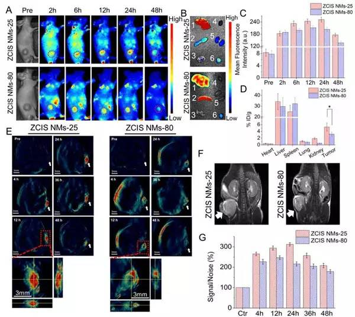
		
信息可视化则研究抽象数据的交互式视觉表示以加强人类认知。抽象数据包括数字和非数字数据，如地理信息与文本，这个领域研究的数据具有抽象的结构，比如柱状图，趋势图，流程图和树状图，这些图表将抽象的概念转化成为可视化信息，常常以数据面板的形式体现。

可视分析学结合了交互式视觉表示以及基础分析过程（统计过程、数据挖掘技术），执行高级别、复杂的活动（推理、决策）。

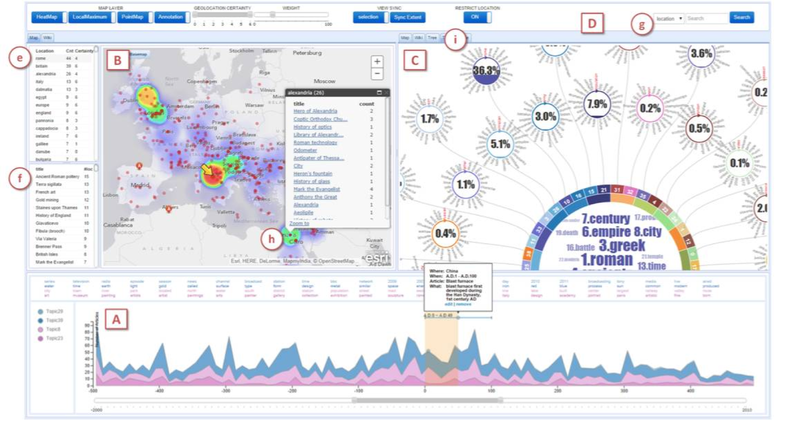

## 二. 在数据科学全过程中的位置

数据科学的主要组成部分包含三个大的阶段：数据整理，探索性数据分析和数据可视化。站在一个更高的位置来看，数据可视化在数据科学中的位置是比较靠后的，是属于最后的成果展示阶段。如果要从头说起的话，首先，在**数据整理**阶段，我们的主要任务是数据的获取和解析，包括一系列对原始数据的清洗和加工工作，这一块的知识领域主要涉及计算机科学。紧接着是**探索性数据分析**阶段，这个阶段要大量使用统计和数据挖掘方面的专业知识，也需要绘制图表来解释数据和探索数据，这个阶段的主要任务是过滤和挖掘。但这个阶段的可视化分析只是你和数据之间的“对话”，是数据想要告诉你什么，而数据可视化则是数据和你的读者之间的对话，是你通过数据想要告诉读者什么，这是它们之间最大的区别。完成了上面两个阶段的内容，才到了我们最后的**数据可视化**阶段，这是一个多学科交叉的领域，涉及到图形设计，信息可视化和人机交互，我们的主要任务是对信息进行精炼，然后通过可视化表示出来，并与读者产生交互。然而，如果将数据科学的这三个阶段理解为按严格顺序进行的“线性”的模型那就大错特错了，它经历的是一个迭代的，非线性的过程。后面的步骤会让你更了解之前所做的工作，可能到了数据可视化阶段，才意识到还有太多疑点要弄明白，我们需要回到上一步重新进行之前的工作，就像画家翻来覆去才能最终完成一幅杰作一样，数据可视化的过程并不是给数据分析这个刚出炉的蛋糕加点糖霜，，而是有一个反复迭代，不断优化的过程。

## 三. 数据可视化的技术栈

数据可视化是一个再典型不过的多学科交叉领域了，可以说数据可视化所需要用到的知识，就是数据科学庞大知识体系的一个剪影。你会感受到数据科学理性的一面，同样也会感受到她感性的一面。你可以穷尽自己的一生，在这个浩如烟海的领域中尽情的探索，常学常新，其乐无穷。

1. 基础数学
	* 三角函数
	* 线性代数
	* 几何算法
2. 图形相关
	* Canvas
	* SVG
	* WebGL
	* 计算图形学
	* 图论
3. 工程算法
	* 基础算法
	* 统计算法
	* 常用的布局算法
4. 数据分析
	* 数据清洗
	* 统计学
	* 数据建模
5. 设计美学
	* 设计原则
	* 美学评判
	* 颜色
	* 交互
	* 认知
6. 可视化基础
	* 可视化编码
	* 可视分析
	* 图形交互
7. 可视化解决方案
	* 图表的正确使用
	* 常见的业务的可视化场景
	
## 四. 数据可视化过程

数据可视化的本质，是充分理解业务的基础上对数据进行深入分析和挖掘，然后将探索数据所得到的信息和知识以可视化的形式展现出来。也就是说我们做的工作其实就是从数据空间映射到图形空间。我们要做的第一步工作是充分的结合业务理解数据，然后采用某些方法选择合适的图表类型，这又要求我们先对图表类型有个比较全面的了解。绘制完图表是不是就完成了呢？其实不是。我们还要对图表进行优化，优化所针对的对象是各种图表元素，对此我们有一系列的设计技巧，下面将一步一步的来介绍这些知识。

### 4.1 结合业务理解数据

离开对业务的理解谈数据分析都是耍流氓。这里介绍一种快速了解数据与业务以开展进一步的探索与分析的方法，叫“5W2H法”。步骤一：WHAT，这是关于什么业务的什么事？数据所描述的业务主题是什么？步骤2：HOW，即如何采集的数据？采集规则会影响后续分析，比如如果是后端数据埋点，那么数据一般是实时的；而如果是前端数据埋点，那么就要进一步弄清楚数据在什么网络状态会上传？无网络状态下是如何处理的？这些都会影响最后数据的质量进而影响分析质量。步骤三：WHY，为什么搜集此数据？我们想从数据中了解什么？数据分析的目标是什么？步骤四：WHEN，是何时段内的业务数据？步骤五：WHERE，是何地域范围内的业务数据？步骤六：WHO，谁搜集了数据（Who）？在企业内可能更关注是来自哪个业务系统。步骤七：HOW MUCH，各种数据有多大的量，足够支持分析吗？数据充足和不足的情况下，分析方法是有所不同的。如果七个问题中有一个答复不能令人满意，则表示这方面有改进余地。

### 4.2 选择图表类型

用简单的三个步骤就可以选择合适的图表类型：一看数据类型，二看数据维度，三看要表达的内容。

我们有两种数据类型，每种数据类型又有两个子类别。首先，我们有**分类数据**和**定量数据**。分类数据用来表示类别，比如苹果，香蕉，梨子和葡萄，就是水果的4种类别，称为**分类定类**；有的分类变量是有一定顺序的，比如可以把红酒的品质分为低，中，高三档，人的身材有偏瘦，正常和肥胖等等，这种特殊的分类变量称为**分类定序**。定量数据也可以进一步分为两类，一类叫**连续值数据**，比如人的年龄；一类叫**离散值数据**，比如猫咪的数量。选择图表的第一步就是要看我要展示的数据是什么类型，最典型的例子就是相关性分析，如果要分析定量数据和定量数据之间的关系，那么散点图无疑是最佳选择，但如果有其他情况出现该怎么选择呢？数据类型直接影响你能选择的图表类型：

* 分析定量数据和定量数据之间的相关性：散点图
* 分析分类数据和分类数据之间的相关性：马赛克图
* 分析分类数据和定量数据之间的相关性：柱形图或箱线图

举几个例子来说明大家可能就明白了。

首先来看一个散点图的例子，比如我要分析一下汽车每加仑行驶的英里数和汽车重量之间的关系，因为两个都是定量数据，那么我们就应该选择散点图：

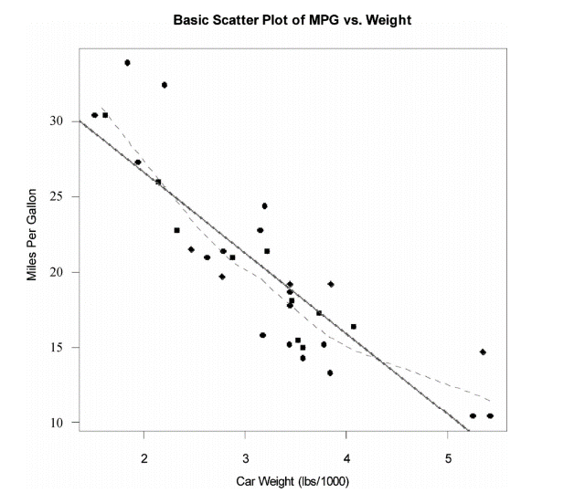

从散点图中我们可以看到每加仑行驶的英里数和汽车重量之间是呈线性负相关关系的，车的重量越重，每加仑行驶的英里数就越小。

下面这个马赛克图分析了《冰与火之歌》中五王之战各战争与战争类别之间的关系：

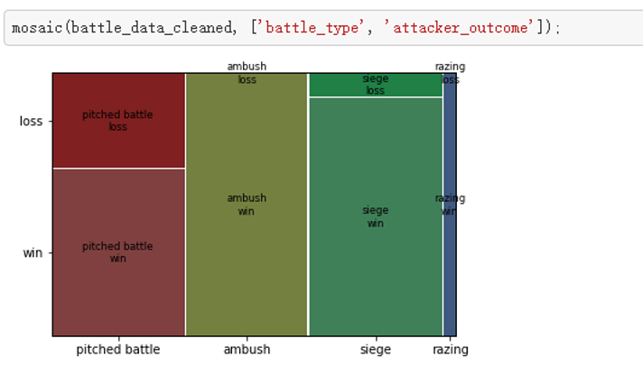

五王之战中总共有这样几种战争类别：

* pitched_battle: 双方军队在一个地点相遇并战斗，这也是最基本的战争类别
* ambush: 以隐身或诡计为主要攻击手段的战争
* siege: 阵地战
* razing: 对未设防位置的攻击

战争类型是分类变量，战争的胜负也是分类变量，马赛克图（也就是下面要介绍的“不等宽柱状图”）分析了战争类型和战争胜负的关系，可以很明显的看出ambush，siege和razing类型的战争，进攻方的胜率都是很高的。这意味着什么？如果我要建立一个预测战争胜负的模型，那么战争类型就是一个非常好的特征。

如果要分析分类数据和定量数据的相关性，那么箱线图就是一个比较好的选择了，请看下面这个例子：

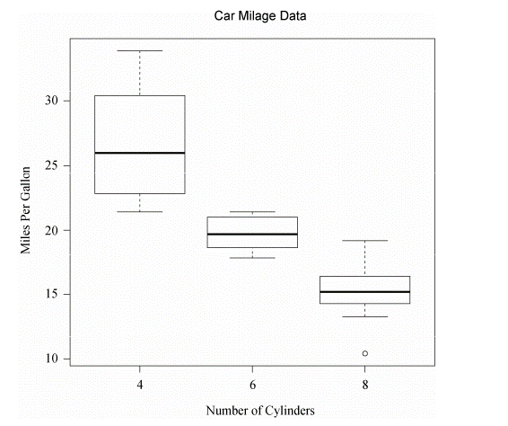

这个箱线图展示了汽车的气缸数量和每加仑行驶的英里数之间的关系，气缸数量越多，每加仑汽油行驶公里数越少，说明相应的油耗越高，间接说明气缸数量和油耗具有相关性。这里可以将气缸数量这个离散型数值变量当做分类变量来看待。

看完了数据类型，接着看维度，要展示的数据是一维，二维还是多维的？如果是一维或者二维，那么一般的统计图表都能满足要求，但如果我们有多维的数据，我们就要把第三维开始的数据映射到上面提到的那7大视觉编码中。比如散点图表示了两个定量数据之间的关系，如果还存在第三个定量数据，那么我们就可以用点的大小来表示，那么散点图就变成了气泡图，如果第三个数据是分类数据，那么我们可以在散点图的基础上标记颜色来表示。

最后，还要考虑可视化主要想表达的内容是什么。对于4大内容：比较，分布，组合和关系，下面这张图给出了一份简单的指南。比如我想表达的是数据的分布，如果是单变量且只有比较少的数据点时，可以选择直方图。比如想表达数据之间的关系，如果是两个变量，则使用散点图，如果有第三个变量，那么如果编码成大小，则得到气泡图。

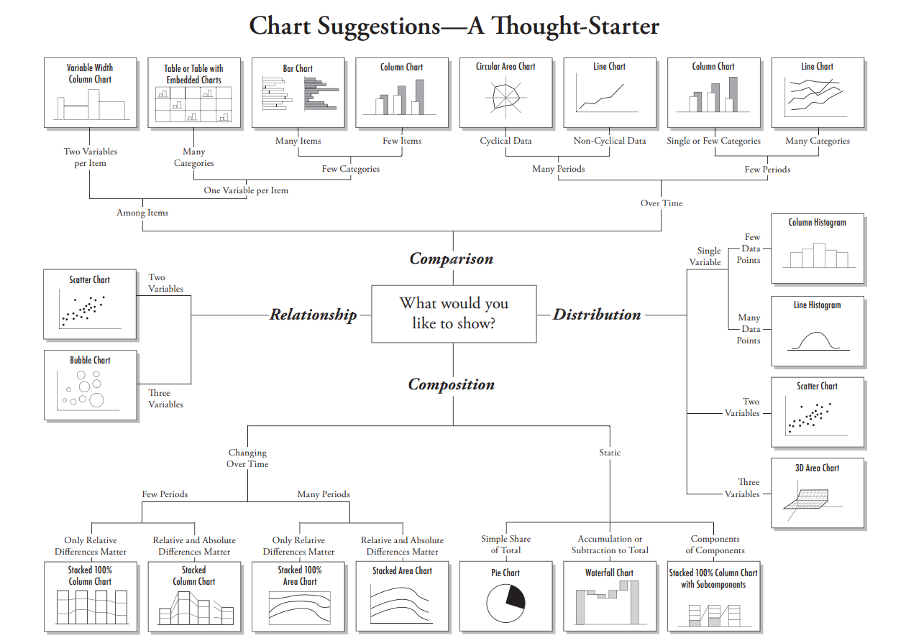
					
### 4.3 图表类型介绍

这也是当初一个比较困扰我的地方，到底有多少种图表可供我选择？作为数据分析师，我们得先对自己的武器库有个基本的认识和了解，才能在使用的时候挑选趁手的武器，下面将介绍一些常见的图表。

#### 4.3.1 对数据进行比较的图表

##### 4.3.1.1 [条形图](https://datavizcatalogue.com/ZH/%E6%96%B9%E6%B3%95/%E6%9D%A1%E5%BD%A2%E5%9B%BE.html)

也称为「棒形图」或「柱形图」。条形图 (Bar Chart) 采用水平或垂直条形（柱形图）来比较不同类别的离散数值。图表其中一条轴代表要比较的具体类别，另一条则用作离散数值的标尺。条形图与直方图不同，前者不会显示数值在某时间段内的持续发展。条形图的离散数据是分类数据，针对的是单一类别中的数量多少。条形图其中一个缺点是当有大量条形时，将难以标签图表。

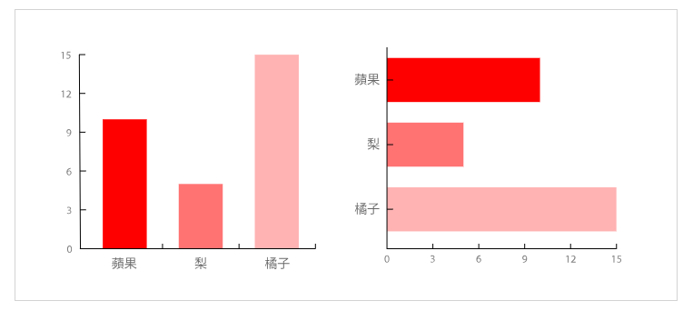

条形图有两种常见的变种：[多组条形图](https://datavizcatalogue.com/ZH/%E6%96%B9%E6%B3%95/%E5%A4%9A%E7%BB%84%E6%9D%A1%E5%BD%A2%E5%9B%BE.html)和[堆叠式条形图](https://datavizcatalogue.com/ZH/%E6%96%B9%E6%B3%95/%E5%A0%86%E5%8F%A0%E5%BC%8F%E6%9D%A1%E5%BD%A2%E5%9B%BE.html)。多组条形图也称为“分组条形图”或“复式条形图”，在同一轴线上将两个或多个数据集并排，绘制数据并进行分类。跟条形图同样，每个条形的长度用来显示不同类别之间的离散数值比较。每个数据系列将获分配一种颜色（或同一颜色的其中一种深浅度）以进行区分，然后每组条形将独立放置，并与其他条形组分隔开。多组条形图通常用来将分组变量或类别与其他数据组（具有相同变量或类别种类）进行比较，也可用来比较迷你直方图，每组内的每个条形将表示变量的显著间隔。多组条形图的缺点：当有太多条形组合在一起时将难以阅读。

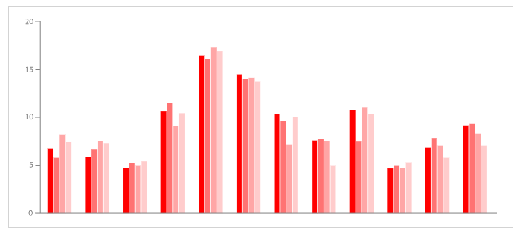

跟多组条形图不同（并排显示条形），堆叠式条形图 (Stacked Bar Graph) 将多个数据集的条形彼此重迭显示，适合用来显示大型类别如何细分为较小的类别，以及每部分与总量有什么关系。堆叠式条形图共分成两种：简单堆叠式条形图将分段数值一个接一个地放置。条形的总值就是所有段值加在一起。适合用来比较每个分组/分段的总量。100% 堆叠式条形图会显示每组占总体的百分比，并按该组每个数值占整体的百分比来绘制，可用来显示每组中数量之间的相对差异。堆叠式条形图的一个主要缺点：条形分段越多，图表就越难以阅读。另外，我们也较难比较不同分段，因为它们不在同一基线之上。

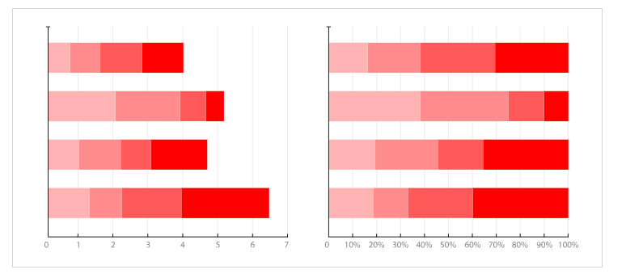

##### 4.3.1.2 [径向条形图](https://datavizcatalogue.com/ZH/%E6%96%B9%E6%B3%95/%E5%BE%84%E5%90%91%E6%9D%A1%E5%BD%A2%E5%9B%BE.html)

径向/圆形条形图只是在极座标系（而非笛卡尔座标系）上绘制的条形图。虽然看起来很美观，但径向条形图的问题在于条形的长度可能会被人误解。即使所代表的数值相同，但外围的条形看起来还是会比较长。由于每个条形都必须处于不同的半径，所以只能用角度来判断数值多少。我们的视觉系统比较擅于理解直线，因此笛卡尔条形图是比较数值的更好选择。因此，使用径向条形图通常只是为了美观。

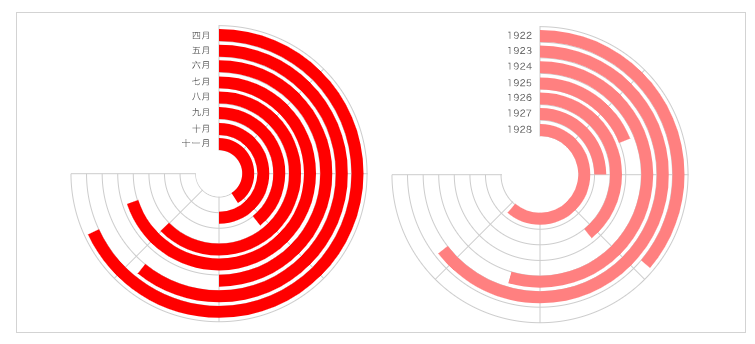

##### 4.3.1.3 [径向柱图](https://datavizcatalogue.com/ZH/%E6%96%B9%E6%B3%95/%E5%BE%84%E5%90%91%E6%9F%B1%E5%9B%BE.html)

也称为“圆形柱图”或“星图”。这种图表使用同心圆网格来绘制条形图。每个圆圈表示一个数值刻度，而径向分隔线（从中心延伸出来的线）则用作区分不同类别或间隔（如果是直方图）。刻度上较低的数值通常由中心点开始，然后数值会随着每个圆形往外增加，但也可以把任何外圆设为零值，这样里面的内圆就可用来显示负值。条形通常从中心点开始向外延伸，但也可以别处为起点以显示数值范围（如跨度图）。此外，条形也可以如堆叠式条形图般堆叠起来。

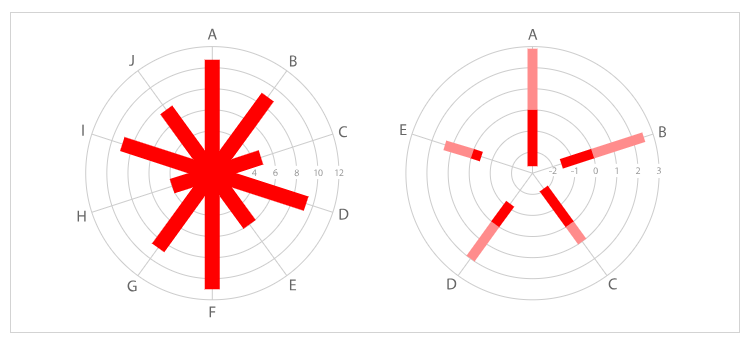

##### 4.3.1.4 [子弹图](https://datavizcatalogue.com/ZH/%E6%96%B9%E6%B3%95/%E5%AD%90%E5%BC%B9%E5%9B%BE.html)

子弹图 (Bullet Graph) 能显示表现数据，功能类似于条形图，但加入更多视像元素，提供更多补充信息。子弹图最初由 Stephen Few 开发，用来取代仪表盘上如里程表或时速表这类图形仪表，解决显示信息不足的问题，而且能有效节省空间，更可除掉仪表盘上一些不必要的东西。主要数据值由图表中间主条形的长度所表示，称为“功能度量”(Feature Measure)；而与图表方向垂直的直线标记则称为“比较度量”(Comparative Measure)，用来与功能度量所得数值进行比较。如果主条形长度超越比较度量标记的位置，则代表数据达标。功能度量背后的分段颜色条形用来显示定性范围得分。每种色调（如上面示例中三种不同深度的灰色）表示不同表现范围等级，如欠佳、平均和良好。当使用子弹图时，建议最多使用五个等级。

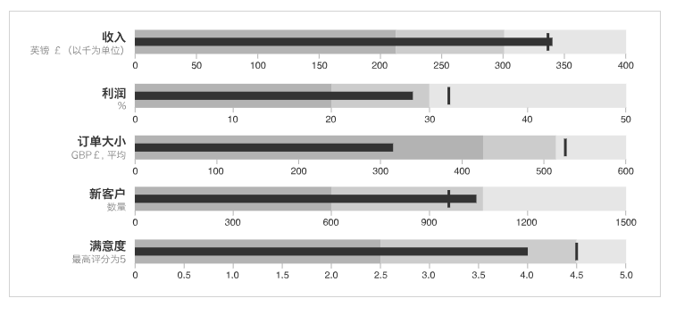

##### 4.3.1.5 [平行座标图](https://datavizcatalogue.com/ZH/%E6%96%B9%E6%B3%95/%E5%B9%B3%E8%A1%8C%E5%BA%A7%E6%A0%87%E5%9B%BE.html)

平行座标图 (Parallel Coordinates Plots) 能显示多变量的数值数据，最适合用来同一时间比较许多变量，并表示它们之间的关系。举个例子：比较具有相同属性的一系列产品（比较不同型号的计算机或汽车规格）。在平行座标图中，每个变量都有自己的轴线，所有轴线彼此平行放置，各自可有不同的刻度和测量单位；或者我们也可以统一处理所有轴线以保持所有刻度间隔均匀。然后我们绘制一系列的直线穿越所有轴线来表示不同数值。轴线排列的顺序可能会影响读者如何理解数据，其中一个原因是相邻变量之间的关系会比非相邻的变量容易进行比较。因此重新排列轴线可以帮助了解不同变量之间的模式或相关性。平行座标图的缺点是容易变得混乱，当数据密集时更加难以辨认。解决这个问题的最好办法是通过一种名为「刷理」的互动技术，突出显示所选定的一条或多条线，同时淡化所有其他线条，让我们能更集中研究感兴趣的部分，并滤除干扰数据。

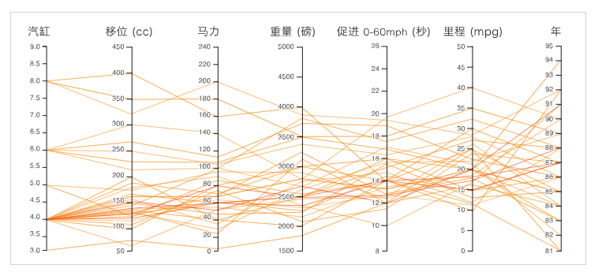

##### 4.3.1.6 [雷达图](https://datavizcatalogue.com/ZH/%E6%96%B9%E6%B3%95/%E9%9B%B7%E8%BE%BE%E5%9B%BE.html)

又称为“蜘蛛图”、“极地图”或“星图”。雷达图 (Radar Chart) 是用来比较多个定量变量的方法，可用于查看哪些变量具有相似数值，或者每个变量中有没有任何异常值。此外，雷达图也可用于查看数据集中哪些变量得分较高/低，是显示性能表现的理想之选。每个变量都具有自己的轴（从中心开始）。所有的轴都以径向排列，彼此之间的距离相等，所有轴都有相同的刻度。轴与轴之间的网格线通常只作指引用途。每个变量数值会画在其所属轴线之上，数据集内的所有变量将连在一起形成一个多边形。

然而，雷达图有一些重大缺点：在一个雷达图中使用多个多边形，会令图表难以阅读，而且相当混乱。特别是如果用颜色填满多边形，表面的多边形会覆盖着下面的其他多边形。此外，过多变量也会导致出现太多的轴线，使图表难以阅读和变得复杂，故雷达图只能保持简单，因而限制了可用变量的数量。雷达图的另一缺点是它未能很有效地比较每个变量的数值。即使借助蜘蛛网般的网格指引，在直线轴上比较数值始终较为容易。

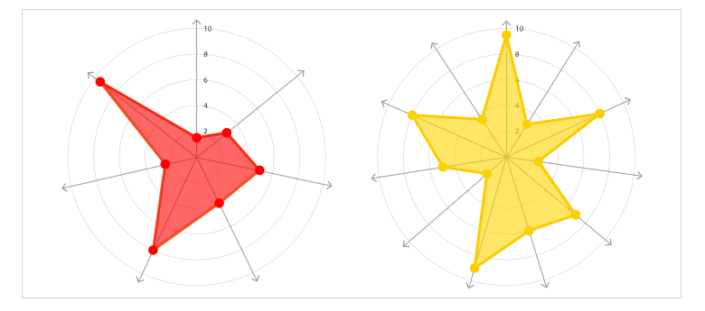

##### 4.3.1.7 [象形图](https://datavizcatalogue.com/ZH/%E6%96%B9%E6%B3%95/%E8%B1%A1%E5%BD%A2%E5%9B%BE.html)

也称为「象形统计图」。使用图案来显示数据量的象形图 (Pictogram Chart) 让人可以更全面地了解小型数据集，而且所用图案通常切合数据主题或类别，例如关于人口数据的图表将使用人物图案。每个图案可以表示一个单位或任何数量或单位（例如每个图案表示 10 个）。通过了解列或行中的图案多少，我们可以对数据集的每个类别进行比较。使用图案能克服语言、文化和教育水平方面的差异，是更具代表性的数据显示方法。举个例子，如果数据是「5 辆车」，图中便会显示 5 个汽车图案。使用象形图时有两点要避免：用于大型数据集，令人难以计数。只显示部分图案，令人混淆它们到底代表什么。

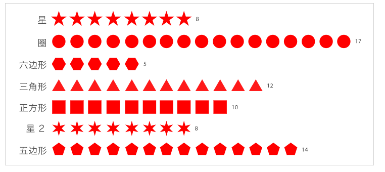

##### 4.3.1.8 [跨度图](https://datavizcatalogue.com/ZH/%E6%96%B9%E6%B3%95/%E8%B7%A8%E5%BA%A6%E5%9B%BE.html)

也称为“范围条形/柱形图”或“浮动条形图”。用来显示数据集内最小值和最大值之间的范围，适合用来比较范围，尤其是已分类的范围。跨度图只集中显示极端数值，不提供任何关于最小值和最大值之间的数值、整体平均值或数据分布等其他信息。

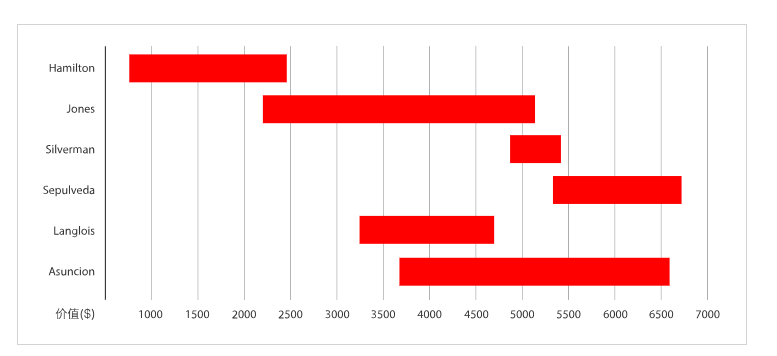

#### 4.3.2 展现比例关系的图表

##### 4.3.2.1 数值之间的比例

###### 4.3.2.1.1 [点阵图表](https://datavizcatalogue.com/ZH/%E6%96%B9%E6%B3%95/%E7%82%B9%E9%98%B5%E5%9B%BE%E8%A1%A8.html)

点阵图表 (Dot Matrix Chart) 以点为单位显示离散数据，每种颜色的点表示一个特定类别，并以矩阵形式组合在一起。适合用来快速检视数据集中不同类别的分布和比例，并与其他数据集的分布和比例进行比较，让人更容易找出当中模式。当只有一个变量/类别时（所有点都是相同颜色），点阵图表相等于比例面积图。

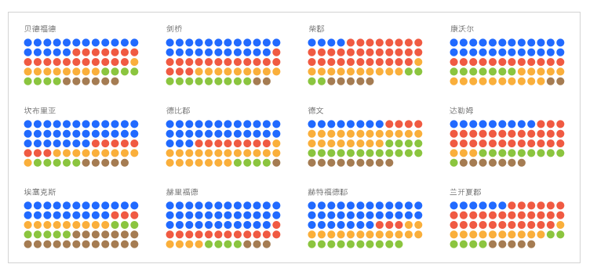

###### 4.3.2.1.2 [南丁格尔玫瑰图](https://datavizcatalogue.com/ZH/%E6%96%B9%E6%B3%95/%E5%8D%97%E4%B8%81%E6%A0%BC%E5%B0%94%E7%8E%AB%E7%91%B0%E5%9B%BE.html)

又称为“极面积图”。统计学家和医学改革家佛罗伦萨‧南丁格尔 (Florence Nightingale) 曾在克里米亚战争期间使用这种图表传达士兵身亡情况，故得名。南丁格尔玫瑰图 (Nightingale Rose Charts) 绘制于极座标系之上。每个数据类别或间隔在径向图上划分为相等分段，每个分段从中心延伸多远（与其所代表的数值成正比）取决于极座标轴线。因此，从极座标中心延伸出来的每一环可以当作标尺使用，用来表示分段大小并代表较高的数值。在南丁格尔玫瑰图中，代表数值的是分段面积，而不是其半径。南丁格尔玫瑰图的主要缺点在于面积较大的外围部分会更加引人注目，这跟数值的增量成反比。

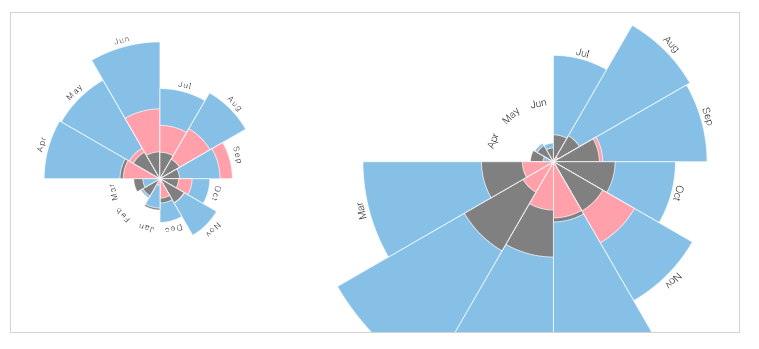

###### 4.3.2.1.3 [比例面积图](https://datavizcatalogue.com/ZH/%E6%96%B9%E6%B3%95/%E6%AF%94%E4%BE%8B%E9%9D%A2%E7%A7%AF%E5%9B%BE.html)

非常适合用来比较数值和显示比例（尺寸、数量等），以便快速全面地了解数据的相对大小，而无需使用刻度。这种图表的缺点在于使用面积图难以得出估值，也就是说它们几乎只能用于通信目的，而不能作分析用途。虽然比例面积图通常使用正方形或圆形，但其实也可以使用任何形状，只要所使用的形状面积是表示数据即可。这种面积图的常见技术错误是，使用长度来确定形状大小，而非计算形状中的空间面积，导致数值出现指数级的增长和减少。

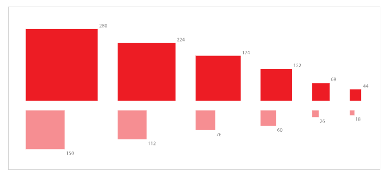

###### 4.3.2.1.4 [字云图](https://datavizcatalogue.com/ZH/%E6%96%B9%E6%B3%95/%E5%AD%97%E4%BA%91%E5%9B%BE.html)

也称为“标签云图”。通过使每个字的大小与其出现频率成正比，显示不同单词在给定文本中的出现频率，然后将所有的字词排在一起，形成云状图案，也可以任何格式排列：水平线、垂直列或其他形状。字云图 (Word Cloud) 也可用于显示获分配元数据的单词。举个例子，我们把世界各地所有国家的名称加到字云中，再将人口数量分配给每个国家，以确定其名称的字体大小。在字云图上使用颜色通常都是毫无意义的，主要是为了美观，但我们可以用颜色对单词进行分类或显示另一个数据变量。字云图通常用于网站或博客上，以描述关键字或标签使用，也可用来比较两个不同的文本。

虽然简单易懂，但字云图有着一些重大缺点：较长的字词会更引人注意。字母含有很多升部/降部的单词可能会更受人关注。分析精度不足，较常是为了美观。

##### 4.3.2.2 部分对整体的比例

###### 4.3.2.2.1 [饼形图](https://datavizcatalogue.com/ZH/%E6%96%B9%E6%B3%95/%E9%A5%BC%E5%BD%A2%E5%9B%BE.html)

饼形图 (Pie Chart) 获广泛应用于项目演示和办公室，把一个圆圈划分成不同比例的分段，以展示各个类别之间的比例和百分比。每个圆弧的长度代表每个类别的所占比例，而全圆则表示所有数据的总和，相等于 100%。

饼形图适合用来快速展示数据比例分布，但主要缺点是：

* 不能显示太多项目，随着所示项目数量增加，每个分段会变得愈来愈小，因此不适合用来显示大量数据。

* 由于本身尺寸较大，加上通常需要图例说明，它比其他图表占用更多空间（比如 100% 堆叠式条形图）。

* 不能准确比较不同的饼形图，因为当比较起来，计算面积大小比长度困难。

尽管如此，如要在单一饼形图中比较给定类别在整体中所占的比例，这仍是有效之选。

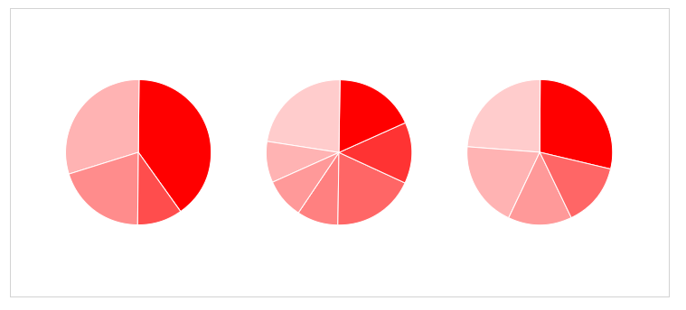

###### 4.3.2.2.2 [圆环图](https://datavizcatalogue.com/ZH/%E6%96%B9%E6%B3%95/%E5%9C%86%E7%8E%AF%E5%9B%BE.html)

圆环图 (Donut Chart) 基本上就是饼形图，只是中间的部分被切掉。然而，圆环图比饼形图略有优势，因为后者不时被人批评，说它只将重点放在不同部分彼此或相对于整体的大小关系，但当与其他饼形图作整体比较时，却不能显示出任何变化。圆环图算是解决了这个问题的其中一部分，让人不再只看“饼”的面积，反面更重视总体数值的变化：专注于阅读弧线的长度，而不是比较“饼与饼”之间的比例不同。另外，圆环图中间的空白处更可以用来显示其他信息，因此更能节省空间。

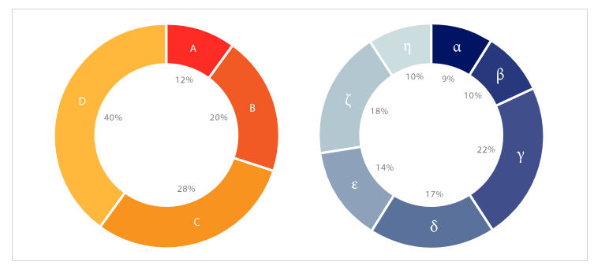

###### 4.3.2.2.3	[桑基图](https://datavizcatalogue.com/ZH/%E6%96%B9%E6%B3%95/%E6%A1%91%E5%9F%BA%E5%9B%BE.html)

桑基图 (Sankey Diagram) 用来显示流向和数量（彼此之间的比例）。箭头或线的宽度用于显示大小，因此箭头越大，流量也越大。在每个流程阶段中，流向箭头或线可以组合在一起，或者往不同路径各自分开。我们可用不同颜色来区分图表中的不同类别，或表示从一个阶段到另一个阶段的转换。桑基图通常用于显示能量、金钱或材料数据的转移，但也可用于显示任何独立系统的流程。

#### 4.3.3 关系

##### 4.3.3.1 显示数据之间的关系

###### 4.3.3.1.1 [热图（矩阵）](https://datavizcatalogue.com/ZH/%E6%96%B9%E6%B3%95/%E7%83%AD%E5%9B%BE.html)

热图 (Heatmap) 通过色彩变化来显示数据。当应用在表格时，热图适合用来交叉检查多变量的数据，方法是把变量放置于行和列中，再将表格内的不同单元格进行着色。热图适用于显示多个变量之间的差异；显示当中任何模式；显示是否有彼此相似的变量；以及检测彼此之间是否存在任何相关性。通常所有水平行都同属一个类别（在左侧或右侧显示的标签）；而所有垂直列将被分配为另一类别（在顶部或底部显示的标签）。每行或每列会再被分成子类别，全都以矩阵形式相互匹配。表格中的单元格内有不同颜色编码的分类数据，或是基于颜色标度的数字数据。单元格内的数据是基于相连行和列中两个变量之间的关系。我们需要图解来帮助阅读热图。分类数据采用不同颜色编码表示，而数字数据则需要一个颜色标度（从一种颜色转到另一种颜色）来帮忙表示高低值之间的差异。我们可以使用一系列的纯色来表示多个范围的数值（0-10、11-20、21-30等），或者可以将两种或多种颜色混合在一起，使用渐变标度来表示单一范围（例如 0 - 100）。由于热图依赖颜色来表达数值，它比较适合用来显示广泛数值数据，因为要准确地指出色调之间的差异始终有难度，也较难从中提取特定数据点（除非在单元格中加入原始数据）。如果将其中一行/列设为时间间隔，热图也可用于显示数据随时间的变化。其中一个例子就是使用热图来比较全年多个城市的温度变化，看看最热或最冷的地方在哪儿：我们可以把要比较的城市在水平行中列出，而垂直列则是月份，然后在单元格内填上温度值。

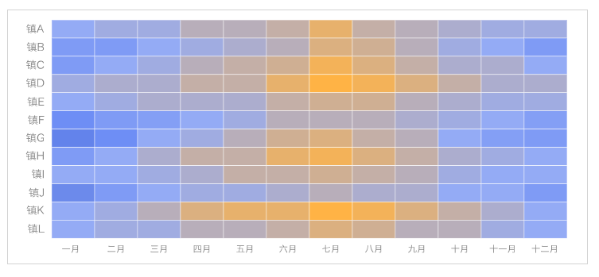

###### 4.3.3.1.2 [文氏图](https://datavizcatalogue.com/ZH/%E6%96%B9%E6%B3%95/%E6%96%87%E6%B0%8F%E5%9B%BE.html)

也称为“集合图”。文氏图 (Venn Diagram) 显示集与集之间所有可能存在的逻辑关系，每个集通常以一个圆圈表示。每个集都是一组具有共同之处的物件或数据。当多个圆圈（集）相互重迭时，称为交集 (intersection)，里面的数据同时具有重迭集中的所有属性。这里只显示了由 2 个数据集组成的文氏图，但也有 3、4、5、6 甚至 7 个数据集相互重迭的例子。

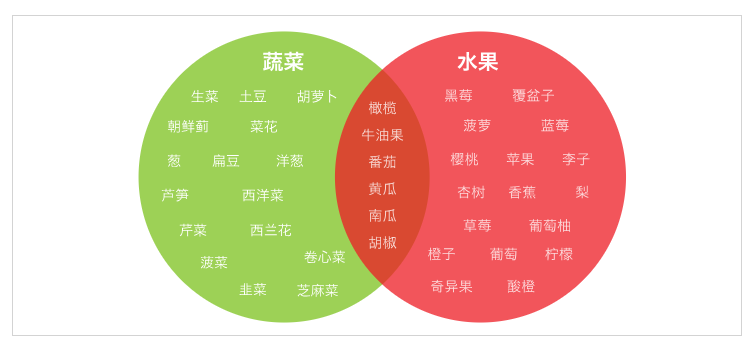

##### 4.3.3.2 用于显示关系

###### 4.3.3.2.1 [弧线图](https://datavizcatalogue.com/ZH/%E6%96%B9%E6%B3%95/%E5%BC%A7%E7%BA%BF%E5%9B%BE.html)

弧线图 (Arc Diagram) 是二维双轴图表以外另一种数据表达方式。在弧线图中，节点 (Nodes) 将沿着 X轴（一维轴）放置，然后再利用弧线表示节点与节点之间的连接关系。每条弧线的粗幼度表示源节点和目标节点之间的频率。弧线图适合用来查找数据共同出现的情况。弧线图的缺点：不能如其他双轴图表般清楚显示节点之间的结构和连接，而且过多连接也会使图表难于阅读。

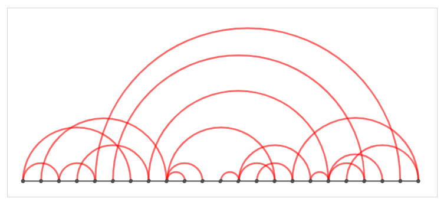

###### 4.3.3.2.2 [弦图](https://datavizcatalogue.com/ZH/%E6%96%B9%E6%B3%95/%E5%BC%A6%E5%9B%BE.html)

弦图 (Chord Diagram) 可以显示不同实体之间的相互关系和彼此共享的一些共通之处，因此这种图表非常适合用来比较数据集或不同数据组之间的相似性。节点围绕着圆周分布，点与点之间以弧线或贝塞尔曲线彼此连接以显示当中关系，然后再给每个连接分配数值（通过每个圆弧的大小比例表示）。此外，也可以用颜色将数据分成不同类别，有助于进行比较和区分。弦图的缺点是过于混乱，尤其是当要显示太多连接的时候。

###### 4.3.3.2.3 [非彩带弦图](https://datavizcatalogue.com/ZH/%E6%96%B9%E6%B3%95/%E9%9D%9E%E5%BD%A9%E5%B8%A6%E5%BC%A6%E5%9B%BE.html)

非彩带弦图 (Non-ribbon Chord Diagram) 是弦图的一个精简版本，仅显示节点和连接线，更加强调数据之间的连接关系。

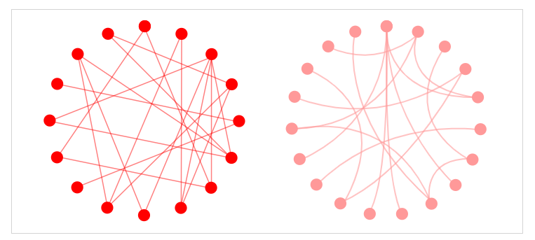

###### 4.3.3.2.4 [网络图](https://datavizcatalogue.com/ZH/%E6%96%B9%E6%B3%95/%E7%BD%91%E7%BB%9C%E5%9B%BE.html)

也称为“网络地图”或“节点链路图”。这种图表使用节点/顶点和连接线来显示事物之间的连接关系，并帮助阐明一组实体之间的关系类型。这些节点通常是圆点或小圆圈，但也可以使用图标。节点之间的连接关系通常以简单的线条表示，但在某些网络图中，并非所有节点和连接都有相同属性，故可藉此显示其他变量，例如通过节点大小或连接线的粗幼来表示其与数值之间的比例。通过描绘出链路连接系统、查找任何节点集群、节点连接的密度或图表布局，网络图可以用来解释各种网络结构。两种主要网络图分别为“不定向”和“定向”网络图；不定向网络图仅显示实体之间的连接，而定向网络图则可显示连接是单向还是双向（通过小箭头）。网络图数据容量有限，并且当节点太多时会形成类似“毛球”的图案，使人难以阅读。

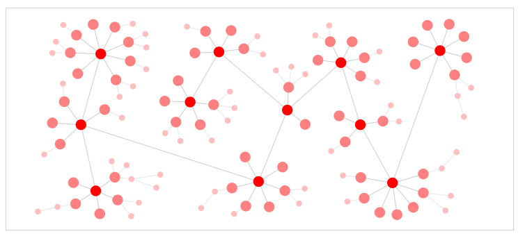

##### 4.3.3.3 用于查找相关性

###### 4.3.3.3.1 [散点图](https://datavizcatalogue.com/ZH/%E6%96%B9%E6%B3%95/%E6%95%A3%E7%82%B9%E5%9B%BE.html)

也称为“点图”、“散布图”或“X-Y 点图”。所谓的散点图 (Scatterplot) 就是在笛卡尔座标上放置一系列的数据点，用来显示两个变量的数值（每个轴上显示一个变量），并检测两个变量之间的关系或相关性是否存在。我们可以通过研究散点图上所显示的模式，了解数据之间的各种相关性，如正比（数值一起增加）、反比（其中一个数值随着另一数值的增加而减小）、零（无相关）、线性、指数级和 U 形。我们也可以通过查看图上数据点的密度来确定相关性的强度。远超出一般聚集区域的数据点称为“异常值”。图表中可加入直线或曲线（尽可能靠近所有数据点）来辅助分析，并显示当所有数据点凝聚成单行时的模样，通常称为“最佳拟合线”或“趋势线”，用来进行估计（通过插值）。如您有一对数值数据，可使用散点图来查看其中一个变量是否在影响着另一个变量。可是请记住，相关性并非因果关系，也有可能存在另一个变量在影响着结果。

###### 4.3.3.3.2 [气泡图](https://datavizcatalogue.com/ZH/%E6%96%B9%E6%B3%95/%E6%B0%94%E6%B3%A1%E5%9B%BE.html)

气泡图是一种包含多个变量的图表，结合了散布图和比例面积图。跟散布图一样，气泡图使用笛卡尔双轴座标来绘制数值点，其中 X 轴和 Y 轴代表不同变量，但与散布图不同的是，每一点都会获分配一个标签或类别（在旁边或图例中显示）。每个数值点再以其圆形面积表示第三个变量。此外，也可以用颜色来区分不同类别或表示别的数据变量。至于时间方面，可以把它设为其中一条轴的变量，或者把数据变量随时间的变化制成动画来显示。通过利用定位和比例，气泡图通常用来比较通常用来比较和显示已标记/已分类圈圆之间的关系。气泡图可用于分析模式/相关性。可是，过多气泡会使图表难以阅读，因此气泡图的数据容量有限。我们可以在图表中加入交互性功能来解决这个问题（点击或把鼠标悬停在气泡上以显示隐藏信息），也可选择重组或筛选分组类别。跟比例面积图一样，圆圈大小需要按照圆的面积来绘制，而非其半径或直径。也就是说，圆圈的大小会呈指数级变化，而且也会导致人类视觉系统出现误解。

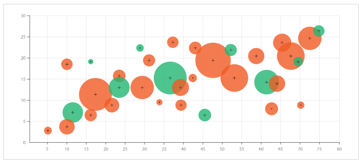
            			
###### 4.3.3.3.3 [不等宽柱状图](https://datavizcatalogue.com/ZH/%E6%96%B9%E6%B3%95/%E4%B8%8D%E7%AD%89%E5%AE%BD%E6%9F%B1%E7%8A%B6%E5%9B%BE.html)

也称为“马赛克图”。不等宽柱状图 (Marimekko Chart) 显示分类数据中一对变量之间的关系，原理类似双向的 100% 堆叠式条形图，但其中所有条形在数值/标尺轴上具有相等长度，并会被划分成段。只有在不等宽柱状图中，两轴才会同时成为具有刻度的变量，这决定了每个分段的宽度和高度。我们可以通过这两个变量来检测类别与其子类别之间的关系。不等宽柱状图的主要缺点在于难以阅读，特别是当含有大量分段的时候。此外，我们也很难准确地对每个分段进行比较，因为它们并非沿着共同基线排列在一起。因此，不等宽柱状图较为适合提供数据概览。

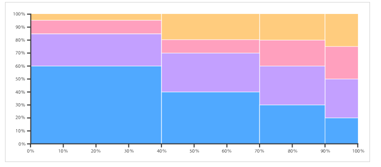

##### 4.3.3.4 层次结构关系

###### 4.3.3.4.1 [圆堆积](https://datavizcatalogue.com/ZH/%E6%96%B9%E6%B3%95/%E5%9C%86%E5%A0%86%E7%A7%AF.html)

也称为“圆形树结构图”。圆堆积 (Circle Packing) 是树形结构图的变体，使用圆形（而非矩形）一层又一层地代表整个层次结构：树木的每个分支由一个圆圈表示，而其子分支则以圆圈内的圆圈来表示。每个圆形的面积也可用来表示额外任意数值，如数量或文件大小。我们也可用颜色将数据进行分类，或通过不同色调表示另一个变量。虽然圆堆积看起来漂亮，但不及树形结构图般节省空间（因为圆圈内会有很多空白处），可是它实际上比树形结构图更能有效显示层次结构。

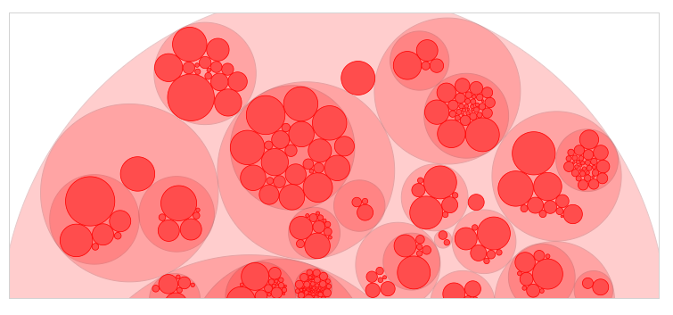

###### 4.3.3.4.2 [旭日图](https://datavizcatalogue.com/ZH/%E6%96%B9%E6%B3%95/%E6%97%AD%E6%97%A5%E5%9B%BE.html)

也称为“多层饼形图”或“径向树图”。这种图表通过一系列的圆环显示层次结构，再按不同类别节点进行切割。每个圆环代表层次结构中的一个级别，中心圆表示根节点，层次结构从这点往外推移。之后圆环会按照其与原属切片的层次关系再被分割，分割角度可以是均等平分，或者与某个数值成比例。我们也可以用不同颜色突出显示层次分组或特定类别。

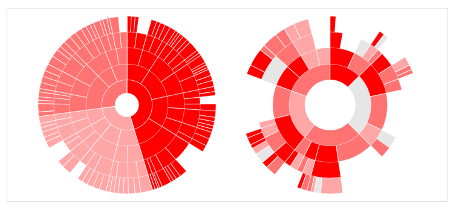

###### 4.3.3.4.3 [树形图](https://datavizcatalogue.com/ZH/%E6%96%B9%E6%B3%95/%E6%A0%91%E5%BD%A2%E5%9B%BE.html)

也称为“组织图”或“链路图”。树形图 (Tree Diagram) 是通过树状结构表示层次结构的一种方式，其结构通常由没有上级/父级成员的元素开始（根节点），然后加入节点，再用线连在一起，称为分支，表示成员之间的关系和连接。最后是枝叶节点（或称为末端节点），是没有子节点的成员。

树形图通常用于：

* 表示家庭关系和血统
* 分类学（分类的实践和科学
* 进化科学（展示物种起源）
* 计算机科学与数学
* 企业和组织的管理工具

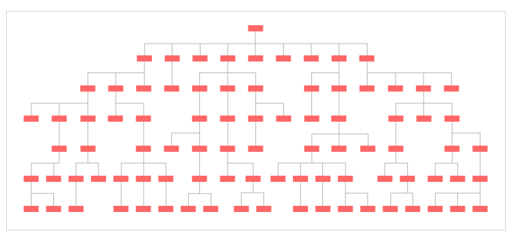

###### 4.3.3.4.4 [树形结构图](https://datavizcatalogue.com/ZH/%E6%96%B9%E6%B3%95/%E6%A0%91%E5%BD%A2%E7%BB%93%E6%9E%84%E5%9B%BE.html)

树状结构图 (Treemap) 是一种利用嵌套式矩形显示层次结构的方法，同时通过面积大小显示每个类别的数量。每个类别会获分配一个矩形区域，而其子类别则由嵌套在其中的小矩形代表。当不同数量被分配到各个类别时，这些矩形的面积大小会与此数量成正比显示：小矩形与小矩形之间（部分对部分）及小矩形与大矩形之间（部分对整体）的面积比例。此外，主类别的面积大小是其所有子类别的总和。如果没有数量分配给子类别，那么其面积则是主类别的总面积平均除以子类别的数目。矩形被划分成子矩形的方式取决于所使用的平铺算法。在众多平铺算法中，最常用的是将每个矩形尽可能保持为正方形的「方格算法」。Ben Shneiderman 最初开发树状结构图用来在计算机上显示大量文件目录，而不会占用太多屏幕空间，因此树状结构图是一种紧凑而且节省空间的层次结构显示方式，可让人快速了解结构。我们也可以通过比较大小来比较类别之间的比例。

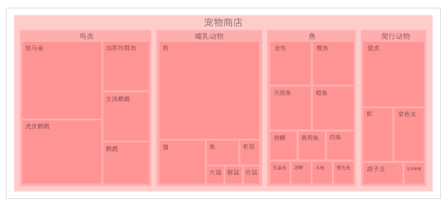

#### 4.3.4 概念

##### 4.3.4.1 [脑力激荡图](https://datavizcatalogue.com/ZH/%E6%96%B9%E6%B3%95/%E8%84%91%E5%8A%9B%E6%BF%80%E8%8D%A1%E5%9B%BE.html)

脑力激荡图（也称为“心智图”）将相关想法、单词、图像和概念联合在一起。通常用来产生想法、查找关联、分类想法、组织信息、显示结构和一般学习的有效工具。脑力激荡图经常在项目初期使用，并作笔记用途。它们也可以用于协同工作和建设团队士气。脑力激荡图的结构如下：从中间位置的主类别开始下笔，其他较小的类别从主类别延伸开来成为子类别，这些子类别也可以各自延伸出自己的相关子类别。

绘制脑力激荡图的简单指引：

1. 从页面中间开始，写下项目主题/标题，再用任何形状圈起来（通常是圆圈或云状）。
2. 想想与主题相关或任何有用/相关的单词或类别。
3. 然后从中心标题（往任何方向）开始画线代表每个类别，并在每条线的末端写下类别名称。
4. 现在想想每个类别有什么相关单词，并如上一步般添加子类别。
5. 如有需要，可重复第 4 步加入新的子类别或相关字词。

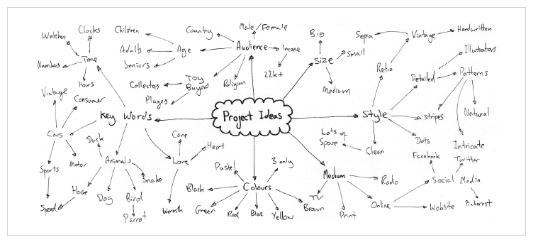

##### 4.3.4.2 [流程图](https://datavizcatalogue.com/ZH/%E6%96%B9%E6%B3%95/%E6%B5%81%E7%A8%8B%E5%9B%BE.html)

也称为“流程地图”、“流程模型”或“工作流程图”。流程图 (Flow Chart) 用于显示流程中的顺序步骤，这种图表使用一系列相互连接的符号绘制出整个过程，使得过程易于理解，并有助于与其他人沟通。流程图可用于解释复杂和/或抽象的过程、系统、概念或算法的运作模式。绘制流程图还可以帮助规划和发展流程，或改进现有的流程图。不同符号代表不同意思，每种都具有各自的特定形状。每个步骤的标签会写在符号形状内；流程图以弧形矩形表示流程的开始和结束；线段或箭头用于显示从一个步骤到另一个步骤的方向或流程；简单的指令或动作用矩形来表示，而当需要作出决定时，则使用钻石形状。除此之外，流程图中还可以使用许多其他符号。流程图可以是水平或垂直。

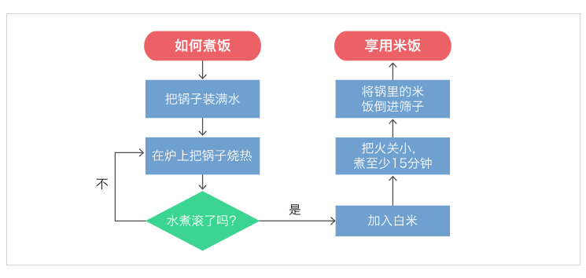

##### 4.3.4.3 [说明图](https://datavizcatalogue.com/ZH/%E6%96%B9%E6%B3%95/%E8%AF%B4%E6%98%8E%E5%9B%BE.html)

说明图旨在使用笔记、标签和图例来解释说明所显示的图像，以便：

* 解释概念或方法
* 描述物件或场所
* 显示事情的运作、移动或变化
* 帮助了解所显示的主题

所使用的图像可以是插图、粗略草图、线框或照片；图像可以是象征性、图像化或真实相片。有时会把图像放大或使用其横截面，以更深入分析或显示更多细节。

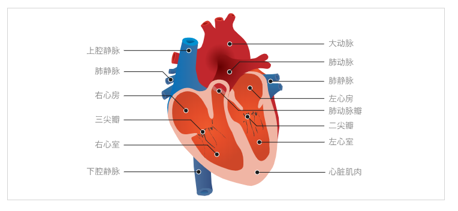

#### 4.3.5 地理空间

##### 4.3.5.1 [气泡地图](https://datavizcatalogue.com/ZH/%E6%96%B9%E6%B3%95/%E6%B0%94%E6%B3%A1%E5%9C%B0%E5%9B%BE.html)

在这种数据地图中，指定地理区域上方会显示圆形图案，圆形面积与其在数据集中的数值会成正比。气泡地图适合用来比较不同地理区域之间的比例，而不会受区域面积的影响（如地区分布图。可是，气泡地图的主要缺点在于：过大的气泡可能会与地图上其他气泡或区域出现重迭。

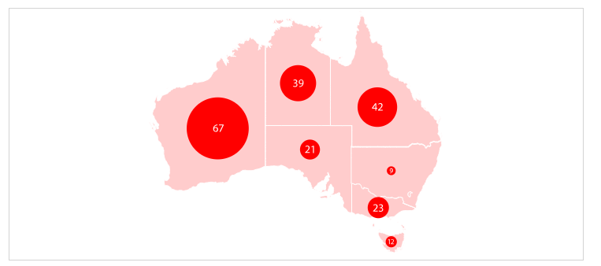

##### 4.3.5.2 [地区分布图](https://datavizcatalogue.com/ZH/%E6%96%B9%E6%B3%95/%E5%9C%B0%E5%8C%BA%E5%88%86%E5%B8%83%E5%9B%BE.html)

地区分布图通常用来显示不同地理分区或区域（不同颜色或图案）与数据变量之间的关系，并把所显示位置的数值变化或模式进行可视化处理。我们在地图上每个区域以不同深浅度的颜色表示数据变量，例如从一种颜色渐变成另一种颜色、单色调渐进、从透明到不透明、从光到暗，甚至动用整个色谱。使用颜色的其中一个缺点是无法准确读取或比较地图中的数值。此外，较大的地区会比较小区域更加显眼，影响读者对阴影数值的感知。绘制地区分布图时的常见错误：对原始数据值（例如人口）进行运算，而不是使用归一化值（例：计算每平方公里的人口）。

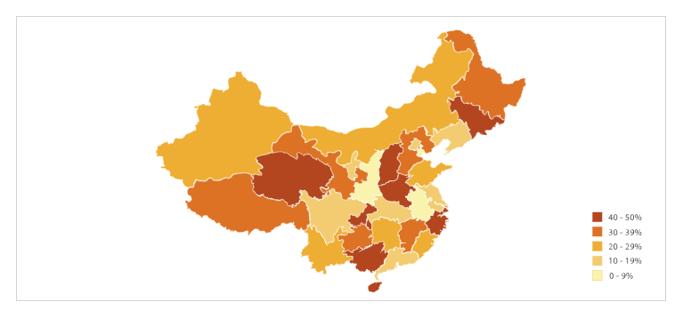

##### 4.3.5.3 [连接地图](https://datavizcatalogue.com/ZH/%E6%96%B9%E6%B3%95/%E8%BF%9E%E6%8E%A5%E5%9C%B0%E5%9B%BE.html)

连接地图 (Connection Map) 即是用直线或曲线连接地图上不同地点的一种图表。虽然连接地图非常适合用来显示地理连接和关系，但我们也可使用单一连接链路来显示地图路线。此外，通过研究连接地图上的连接分布或集中程度，我们也可以用它来显示空间格局。

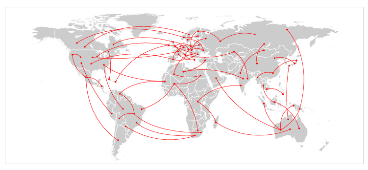

##### 4.3.5.4 [点示地图](https://datavizcatalogue.com/ZH/%E6%96%B9%E6%B3%95/%E7%82%B9%E7%A4%BA%E5%9C%B0%E5%9B%BE.html)

也称为“点示分布图”或“点示密度图”。点示地图 (Dot Map) 在地理区域上放置相等大小的圆点，旨在检测该地域上的空间布局或数据分布。共有两种点示地图：一对一（每点代表单一计数或一件物件）和一对多（每点表示一个特定单位，例如 1 点 = 10棵树）。点示地图非常适合用来查看物件在某地域内的分布状况和模式，而且容易掌握，能提供数据概览，可是在检索精确数值方面表现则不太理想。

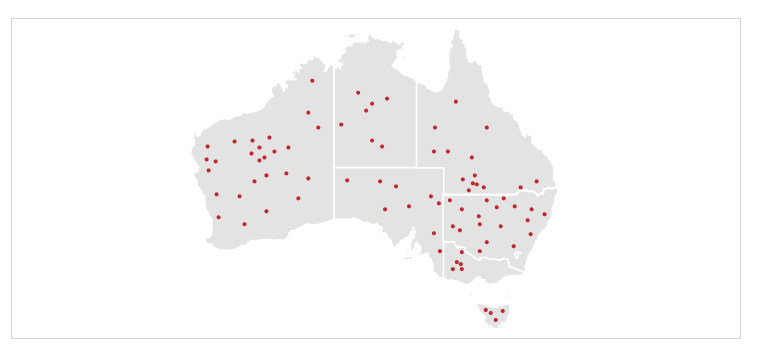

##### 4.3.5.5 [流向地图](https://datavizcatalogue.com/ZH/%E6%96%B9%E6%B3%95/%E6%B5%81%E5%90%91%E5%9C%B0%E5%9B%BE.html)

流向地图 (Flow Map) 在地图上显示信息或物体从一个位置到另一个位置的移动及其数量，通常用来显示人物、动物和产品的迁移数据。单一流向线所代表的移动规模或数量由其粗幼度表示，有助显示迁移活动的地理分布。流向地图的绘制方法：从原点出发，再往外绘制「流向线」。箭头可用于表示方向，或者移动是进入还是外出。不用箭头则可以用来代表贸易往来。建议将流向线合并/捆绑在一起并避免彼此交迭，有助减少地图上的视觉混乱。

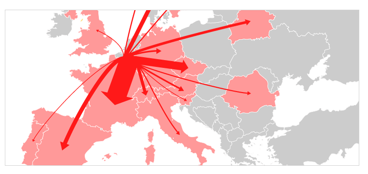

#### 4.3.6 分布

##### 4.3.6.1 显示频率及数据在某时间段内的分布或分组状况

###### 4.3.6.1.1 [箱形图](https://datavizcatalogue.com/ZH/%E6%96%B9%E6%B3%95/%E7%AE%B1%E5%BD%A2%E5%9B%BE.html)

箱形图（又称为“盒须图”或“箱线图”）能方便显示数字数据组的四分位数。从盒子两端延伸出来的线条称为「晶须」(whiskers)，用来表示上、下四分位数以外的变量。异常值 (Outliers) 有时会以与晶须处于同一水平的单一数据点表示。这种箱形图可以垂直或水平的形式出现。箱形图通常用于描述性统计，是以图形方式快速查看一个或多个数据集的好方法。虽然与直方图或密度图相比似乎有点原始，但它们占用较少空间，当要比较很多组或数据集之间的分布时便相当有用。

下面是可以从箱形图得出的观察结果：

* 关键数值，例如平均值、中位数和上下四分位数等。
* 任何异常值（以及它们的数值）。
* 数据分布是否对称。
* 数据分组有多紧密。
* 数据分布是否出现偏斜（如果是，往什么方向偏斜）。

最常用的两种箱形图：可变宽度和带凹槽的箱形图。

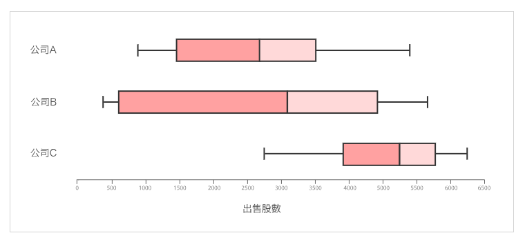

###### 4.3.6.1.2 [密度图](https://datavizcatalogue.com/ZH/%E6%96%B9%E6%B3%95/%E5%AF%86%E5%BA%A6%E5%9B%BE.html)

又称为“密度曲线图”。密度图 (Density Plot) 用于显示数据在连续时间段内的分布状况。这种图表是直方图的变种，使用平滑曲线来绘制数值水平，从而得出更平滑的分布。密度图的峰值显示数值在该时间段内最为高度集中的位置。密度图其中一个比直方图优胜的地方，是由于它们不受所使用分组数量（典型直方图中所使用的条形）的影响，所以能更好地界定分布形状 。举个例子，仅用 4 个条形的直方图所产生的分布形状，总不及使用 20 个条形的直方图般容易解读。然而，密度图则不会有这种问题。

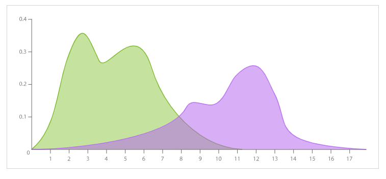

###### 4.3.6.1.3 [直方图](https://datavizcatalogue.com/ZH/%E6%96%B9%E6%B3%95/%E7%9B%B4%E6%96%B9%E5%9B%BE.html)

直方图适合用来显示在连续间隔或特定时间段内的数据分布，当中每个条形表示每个间隔/时间段中的频率。直方图的总面积也相等于数据总量。直方图有助于估计数值集中位置、上下限值以及确定是否存在差距或异常值；也可粗略显示概率分布。

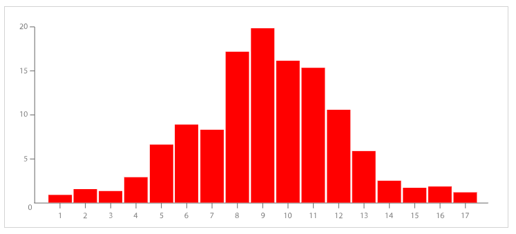

###### 4.3.6.1.4 [小提琴图](https://datavizcatalogue.com/ZH/%E6%96%B9%E6%B3%95/%E5%B0%8F%E6%8F%90%E7%90%B4%E5%9B%BE.html)

小提琴图 (Violin Plot) 用于显示数据分布及其概率密度。这种图表结合了箱形图和密度图的特征，主要用来显示数据的分布形状。中间的黑色粗条表示四分位数范围，从其延伸的幼细黑线代表 95% 置信区间，而白点则为中位数。箱形图在数据显示方面受到限制，简单的设计往往隐藏了有关数据分布的重要细节。例如使用箱形图时，我们不能了解数据分布是双模还是多模。虽然小提琴图可以显示更多详情，但它们也可能包含较多干扰信息。

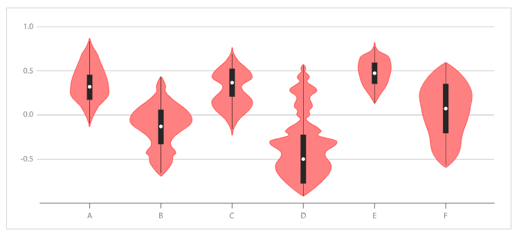

##### 4.3.6.2 按人口年龄和性别显示分布

###### 4.3.6.2.1 [人口金字塔](https://datavizcatalogue.com/ZH/%E6%96%B9%E6%B3%95/%E4%BA%BA%E5%8F%A3%E9%87%91%E5%AD%97%E5%A1%94.html)

也称为“年龄性别金字塔”。人口金字塔 (Population Pyramid) 是彼此背靠背的一对直方图（每边代表一个性别），显示所有年龄组和男女人口的分布情况。X 轴表示人口数量，Y 轴列出年龄组别。人口金字塔最适合用来检测人口模式的变化或差异。多个人口金字塔放在一起更可用于比较各国或不同群体之间的人口模式。人口金字塔的形状可以用来理解人口结构。举个例子，底部较宽、顶部狭窄的金字塔表示该群体具有很高的生育率和死亡率；相反顶部较宽、底部狭窄的金字塔代表出现人口老龄化，而且生育率低。除此之外，人口金字塔也可用来推测人口的未来发展。如果人口出现老龄化，而且生育率低，最终会导致没有足够后代照顾老人的社会问题。其他理论包括「青年膨胀」，即社会存在大量 16-30 岁的青年（特别是男性），容易导致社会动荡、战争和恐怖主义。因此，人口金字塔对生态学、社会学和经济学等领域都相当有用。

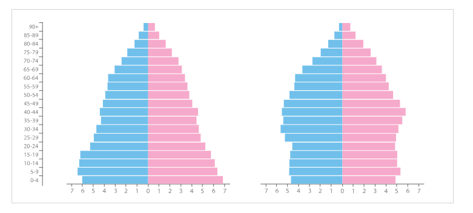

#### 4.3.7 时间维度

##### 4.3.7.1 某时间段内的数据趋势或变化

###### 4.3.7.1.1 [甘特图](https://datavizcatalogue.com/ZH/%E6%96%B9%E6%B3%95/%E7%94%98%E7%89%B9%E5%9B%BE.html)

甘特图 (Gantt Chart) 通常用作项目管理的组织工具，显示活动（或任务）列表和持续时间，也显示每项活动何时开始和结束。甘特图适合用来规划和估计整个项目的所需时间，也可显示相互重迭的活动。我们采用表格来绘制甘特图：水平行代表活动，垂直列则是时间刻度。每项活动的持续时间由沿着时间刻度绘制的条形长度来表示。条形的开始位置代表着活动的开始；而条形的结束位置则是活动结束之时。我们可使用不同颜色的条形来将活动分类。要显示活动完成的百分比，我们可以把条形部分填满、使用不同深浅度或使用不同颜色，来区分已完成的内容和剩下要完成的内容。相连的箭头可用来显示哪些任务相互依赖，而关键路径（完成项目必需的关键活动）也可以通过特别箭头表示。我们也可在甘特图内使用符号来表示各个里程碑，而垂直穿越图表的线段则是当前日期标记。

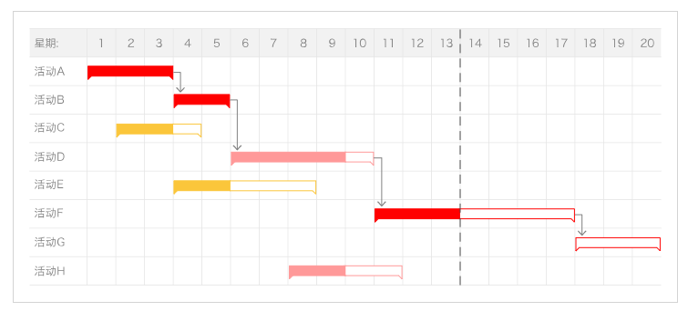

###### 4.3.7.1.2 [折线图](https://datavizcatalogue.com/ZH/%E6%96%B9%E6%B3%95/%E6%8A%98%E7%BA%BF%E5%9B%BE.html)

折线图用于在连续间隔或时间跨度上显示定量数值，最常用来显示趋势和关系（与其他折线组合起来）。此外，折线图也能给出某时间段内的“整体概览”，看看数据在这段时间内的发展情况。要绘制折线图，先在笛卡尔座标上定出数据点，然后用直线把这些点连接起来。通常 Y 轴用于定量数值，而 X 轴则是分类或顺序刻度。负值可以显示在 X 轴下方。

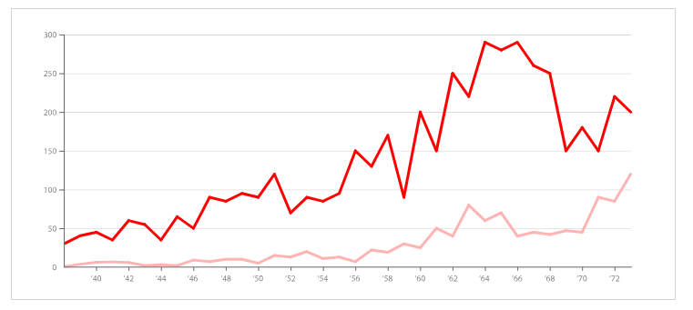

###### 4.3.7.1.3 [螺旋图](https://datavizcatalogue.com/ZH/%E6%96%B9%E6%B3%95/%E8%9E%BA%E6%97%8B%E5%9B%BE.html)

也称为“时间系列螺旋图”。这种图表沿阿基米德螺旋线 (Archimedean spiral) 画上基于时间的数据。图表从螺旋形的中心点开始往外发展。螺旋图十分多变，可使用条形、线条或数据点，沿着螺旋路径显示。螺旋图很适合用来显示大型数据集，通常显示长时间段内的数据趋势，因此能有效显示周期性的模式。我们可以将颜色分配给每个时间段以进行区分，并允许每个时期之间进行一些比较。举个例子，如果我们要显示一年中的数据，可以在图表上为每个月分配不同颜色。

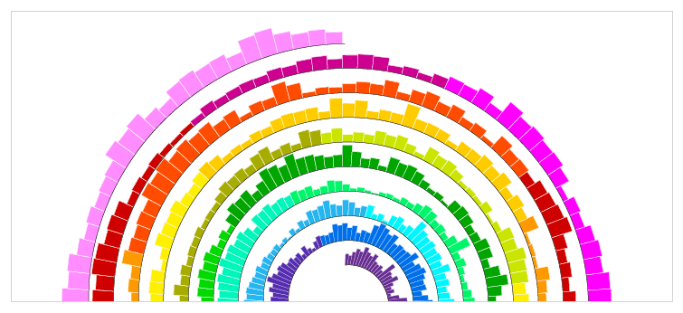

###### 4.3.7.1.4 [量化波形图](https://datavizcatalogue.com/ZH/%E6%96%B9%E6%B3%95/%E9%87%8F%E5%8C%96%E6%B3%A2%E5%BD%A2%E5%9B%BE.html)

这种图表是堆叠式面积图的一种变体，但其数值并非沿着固定直线轴来绘制，而是围绕着不断变化的中心基线。通过使用流动的有机形状，量化波形图 (Stream Graph) 可显示不同类别的数据随着时间的变化，这些有机形状有点像河流，因此量化波形图看起来相当美观。在量化波形图中，每个波浪的形状大小都与每个类别中的数值成比例。与波形图平行流动的轴用作时间刻度。我们也可以用不同颜色区分每个类别，或者通过改变色彩来显示每个类别的附加定量值。量化波形图很适合用来显示大容量的数据集，以便查找各种不同类别随着时间推移的趋势和模式。举个例子，波浪形状中的季节性峰值和谷值可以代表周期性模式。波形图也可以用来显示大量资产在一段时间内的波动率。量化波形图的缺点在于它们存在可读性的问题，当显示大型数据集时，这类图就特别显得混乱。具有较小数值的类别经常会被「淹没」，以让出空间来显示具有更大数值的类别，使我们不能看到所有数据。此外，我们也不可能读取到波形图中所显示的精确数值，因为它们都是由代码生成的。因此，波形图还是比较适合不想花太多时间深入解读图表和探索数据的人，它适合用来显示一般表面的数据趋势。此外，当他们以互动形式展示时，比静态或印刷出来更有效率。

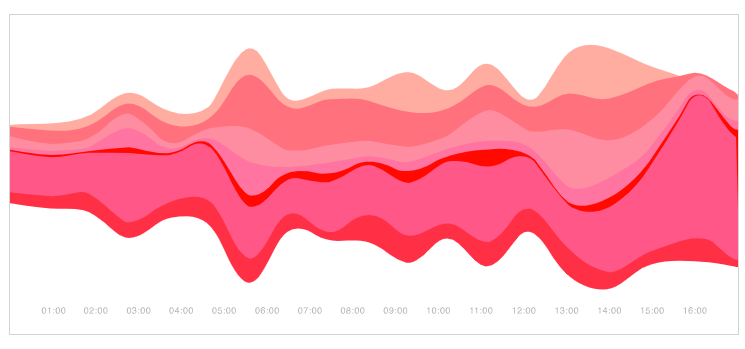

###### 4.3.7.1.5 [面积图](https://datavizcatalogue.com/ZH/%E6%96%B9%E6%B3%95/%E9%9D%A2%E7%A7%AF%E5%9B%BE.html)

面积图 (Area Graph) 是折线图的一种，但线下面的区域会由颜色或纹理填满。要绘制面积图，首先在笛卡儿双轴座标上标记各个数据点，再用线把它们连起来，最后把线下方的空间填满。跟折线图一样，面积图可显示某时间段内量化数值的变化和发展，最常用来显示趋势，而非表示具体数值。其中两种较常用的面积图：分组式和堆叠式面积图。分组式面积图在相同的零轴开始，而堆叠式面积图则从先前数据系列的最后数据点开始。

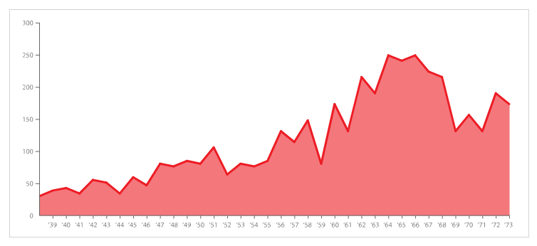

###### 4.3.7.1.6 [堆叠式面积图](https://datavizcatalogue.com/ZH/%E6%96%B9%E6%B3%95/%E5%A0%86%E5%8F%A0%E5%BC%8F%E9%9D%A2%E7%A7%AF%E5%9B%BE.html)

堆叠式面积图 (Stacked Area Graph) 的原理与简单面积图相同，但它能同时显示多个数据系列，每一个系列的开始点是先前数据系列的结束点。整个图表代表所有数据的总和。堆叠式面积图使用区域面积来表示整数，因此不适用于负值。总的来说，它们适合用来比较同一间隔内多个变量的变化。

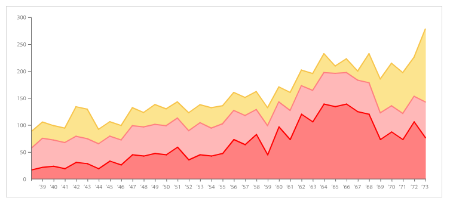

##### 3.7.2 显示某时间段内事件的发生顺序

###### 3.7.2.1 [日历](https://datavizcatalogue.com/ZH/%E6%96%B9%E6%B3%95/%E6%97%A5%E5%8E%86.html)

在人类历史上，我们曾经开发出各种日历系统作为组织工具，帮助我们提前做好计划。我们也把日历当作可视化工具，适用于显示不同时间段，以及活动事件的组织情况。时间段通常以不同单位显示，例如日、周、月和年。任何日期就是这个系统中所指定的单一日子。今天我们最常用的日历形式是公历，每个月份的月历由七个垂直列组成（代表每周七天），另有约五至六行以水平方式代表星期。可是，日历格式并没有严格规定，所以市面上有各式各样不同的设计，只要能以时间顺序显示日期或时间单位便可。

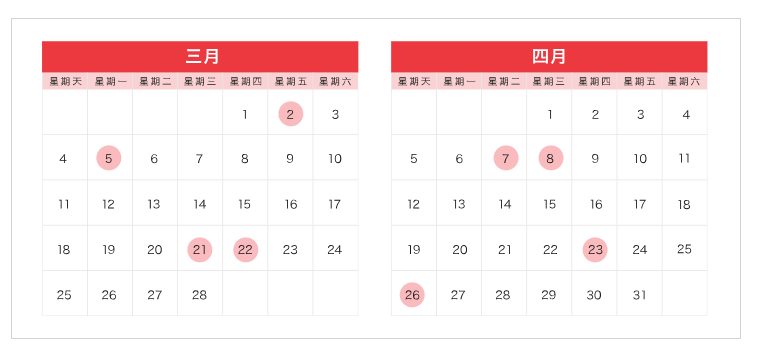

###### 3.7.2.2 [时间线](https://datavizcatalogue.com/ZH/%E6%96%B9%E6%B3%95/%E6%97%B6%E9%97%B4%E7%BA%BF.html)

时间线 (Timeline) 是以时间顺序显示一系列事件的图象化方式。某些时间线甚至按时间长度比例绘制，而其他的则只按顺序显示事件。时间线的主要功能是传达时间相关信息，用于分析或呈现历史故事。如果是按比例绘制的时间线，我们可以通过查看不同事件之间的时间间隔，了解事件发生的时间或即将在何时发生，从中查找时间段内的事件是否遵循任何模式，或者事件在该时间段内如何分布。有时时间线会与图表相互结合，显示定量数据随时间的变化。

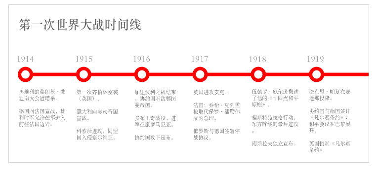

###### 3.7.2.3 [时间表](https://datavizcatalogue.com/ZH/%E6%96%B9%E6%B3%95/%E6%97%B6%E9%97%B4%E8%A1%A8.html)

时间表 (Timetable) 可用作预定事件、任务和行动的引用和管理工具。使用表格按时间顺序和/或字母顺序组织数据，能有助用户快速进行引用。时间表通常用来显示列车和其他交通工具的到达和离开时间。

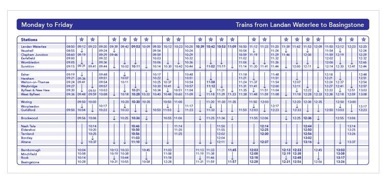

### 4.4 图表元素

了解了大部分的图表类型，下面我们来深入研究一下，一个图表包含的元素：标尺，坐标系，背景信息和视觉编码。

#### 4.4.1 标尺

标尺一般出现在图表的坐标轴上，有四类：线性，分类，百分比和对数。线性标尺最常见，上面刻度的间距处处相等。分类标尺主要用在分类数据上，有序分类要对分类标尺做排序，常见的例子有：年龄段，性别和学历等。百分比标尺是线性标尺的特殊情况，刻度值为百分比，比如上面提到的堆叠式条形图中就出现过这种标尺。对数标尺按照对数化将坐标轴压缩，适合数值跨度非常大的场景，或者需要将分布转为正态分布的场景。

#### 4.4.2 坐标系

从上面对各种图表的介绍就知道，图表中最常见的坐标系就是直角坐标系了，其距离的衡量为欧氏距离。而像饼图，径向柱图等，使用的就是极坐标系，距离的衡量为弧度。地理坐标系常出现在各种地理信息图表中，距离的衡量是经纬度。

#### 4.4.3 背景信息

图表中往往还包含有背景信息，比如图例，各种主/副标题，坐标轴标签以及标记的度量单位。

#### 4.4.4 视觉编码

上面我们说，数据可视化就是将数据空间映射到图形空间。这种映射的关键，就是将数据的信息用视觉编码进行表示，七种最常见的视觉编码有：

1. 位置：趋势规律和分布规律，典型例子：散点图
2. 长度:人眼对于长度的感受往往是最准确的，典型例子：条形图
3. 弧度：弧度越大，值越大，典型例子：饼图
4. 方向：坐标系中一个向量的方向
5. 面积/体积：面积/体积大则绝对值大
6. 形状：代表不同的类别
7. 色彩与饱和度：不同的颜色通常用来表示分类数据，饱和度越深代表数值越大

这些视觉编码到底哪个更有效？已经有学者对其进行过研究，上面这个排序就是按有效性从高到低排列的，放心使用吧。

### 4.5 设计技巧

有一种数据可视化的设计技巧叫做pre-attentive processing，即前意识处理。简单的说就是我们要用醒目的颜色突出数据，然后淡化其他的元素，并高亮显示重点的内容。一种增强数据比较的方法是提升色阶的跨度，即根据要展示的数据合理增大标尺跨度，添加添加参考线(建议采用虚线)，参考线作为对比基准，可有效增强数值与基准的比较。这样的一些可视化增强的设计技巧既减少了读者理解的步骤，又合理注解引导，提供了背景信息，分析结论，又补充了必要的统计学概念，比如图表的解释，这方面做的比较好的一个案例是Tableau制作的西班牙首都马德里可视化[面板](https://public.tableau.com/en-us/s/gallery/madrid-details?gallery=featured)，面板中为不熟悉的读者给出了人口金字塔图表的解释。

另一种系统地衡量可视化图表效果的公式叫做数据墨水比公式（data-ink ratio），定义为用于描述数据的墨水量/用于描述所有其他东西的墨水量。这个比值越高，说明图表中越多的视觉编码被用于传递真正的信息，而不是出现冗余，或者用于描述一些其他的东西。举个例子，下面这个展示食物热量的图表就是一个典型案例。随随便便就能找出图表中的各种问题：毫无意义的纹理背景，加粗显示的文字和坐标轴，五颜六色的柱状图，各种立体阴影效果，重复呈现的信息……很容易让人产生视觉疲劳。

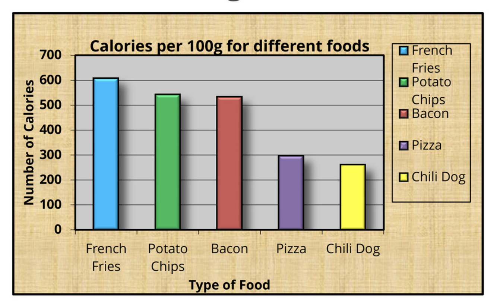

按照少即是多的原则，对于这样的图表我们要进行一步一步的优化，清理各种图表垃圾：去掉了各种纹理背景，去掉了各种坐标轴，直接将数值显示在柱状图上，然后对文字进行淡化，并用颜色突出显示我们想要读者一眼就看到的类别（培根），去掉了一切立体和阴影的效果，最后得到了下面这个图表：

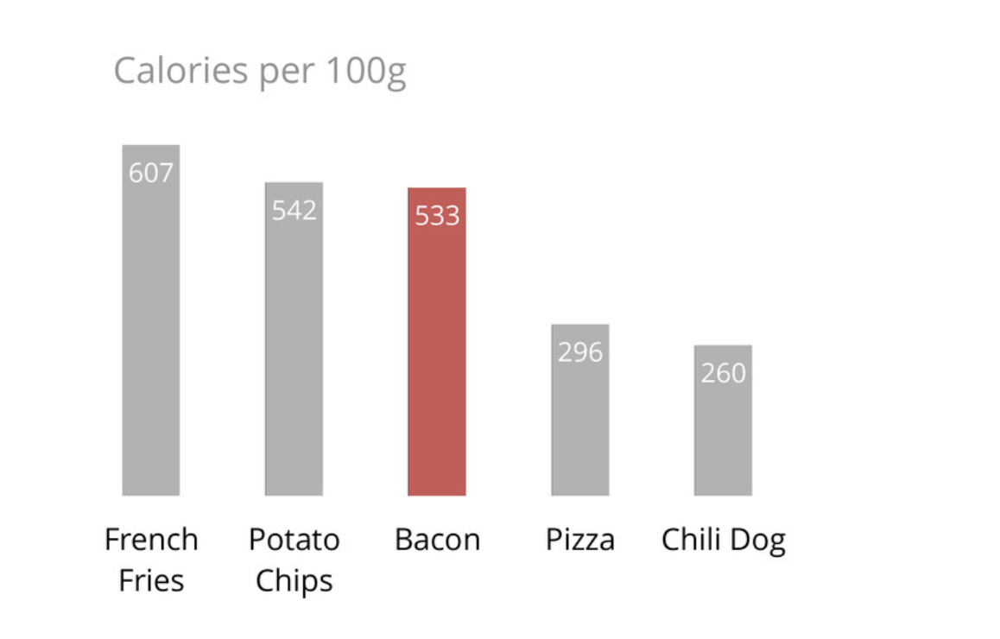

对比来看，下面这个图表的数据墨水比是不是比上面要高很多？整个图表传达的信息也要清晰很多，读者几乎花不了什么时间就能看懂要表达的意思，真正做到了图简意赅！另一种常见的公式为失真系数（lie factor），是用图表中展示的效果大小/数据中展示的效果大小得到的，一般在0.95到1.05之间最佳。

## 五. 叙事结构

一个好的数据可视化，不光要把每一个图表绘制好，还要把所有的图表以一种适当的方式串起来，给观众讲一个故事。也就是说，好的数据可视化一定是一个优秀的Story Teller。这种串联图表的方式叫做“叙事结构”，有三种常见的数据可视化叙事结构：作者驱动型，读者驱动型和马提尼酒杯型。

### 5.1 作者驱动型

作者驱动型的叙事结构有明确的开头和结尾，它以一种线性的方式来讲故事，读者没有多少自由选择的余地，它的特点是顺序严谨，信息量大，具有一定的清晰度和速度。阅读数据可视化的方式和顺序已经被作者预先设定好了，读者只能按照这一预先设定来进行。一般来说，这类数据可视化通过一个播放按钮或者按顺序组织的页码标签，读者点击播放或者按顺序一页一页的显示，就能按照作者预设的线性化的思路完成对整个数据可视化的解读。比如关于[Facebook IPO](https://archive.nytimes.com/www.nytimes.com/interactive/2012/05/17/business/dealbook/how-the-facebook-offering-compares.html)这个可视化图表就是典型的作者驱动型。通过点击上面的按钮，读者可以像放幻灯片一样以严格的顺序阅读关于Facebook首次公开募股有关信息，每个阶段都能看到数据的延伸和转换。

### 5.2 读者驱动型
反过来，如果数据可视化有明确的开头，但给予读者很大的自由去探索数据，与数据自由互动，提出问题，探索故事进展并有机会讲述自己的发现。那么这种数据可视化就是读者驱动型的。[Marid In Detail](https://public.tableau.com/en-us/s/gallery/madrid-details?gallery=featured)和[LinkedIn Top Skills 2016](https://public.tableau.com/profile/matt.chambers#!/vizhome/LinkedInTopSkills2016-MakeoverMonday/LinkedInTopSkills2016-MakeoverMonday)就属于这种类型的可视化：没有任何预先的设定，读者通过自己点击面板上的可视化元素完成解读，每个人解读的方式不一样，得到的结论也就丰富多彩，各有千秋。

### 5.3 马提尼酒杯型

最后，我们可以把作者驱动型和读者驱动型结合起来，构造更复杂的叙事结构，称为[马提尼酒杯型](https://mastersofmedia.hum.uva.nl/blog/2011/05/03/narrative-structures-in-data-visualizations-to-improve-storytelling/)叙事结构，这种叙事结构跟上面两种一样，有一个明确的开头。但首先读者要沿着作者预设的单一路径进行阅读，随后当这一过程结束时，读者会开始他们自己的自由探索，就像下面这个图展示的一样：

马提尼酒杯型叙事结构的一个典型可视化例子是[枪击死亡人数](https://guns.periscopic.com/?year=2013)，整个数据可视化背景是黑色的，切合主题给人一种很压抑的感觉。它首先通过动画的形式给出了1万多名受害者，并预测了如果没有遭遇枪击，他们可能生存的年数。它使用计数器计数了总的人数，和他们被偷走的年岁，这是可视化之初一个明确的叙事（作者驱动型），如下图所示：

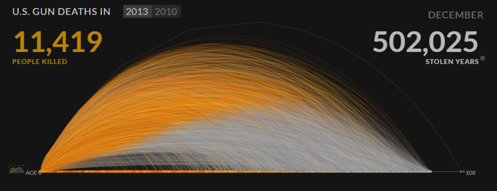

然后读者就可以自由的进行探索了，比如将鼠标移到其中一根抛物线上，然后查看某个受害者的信息：

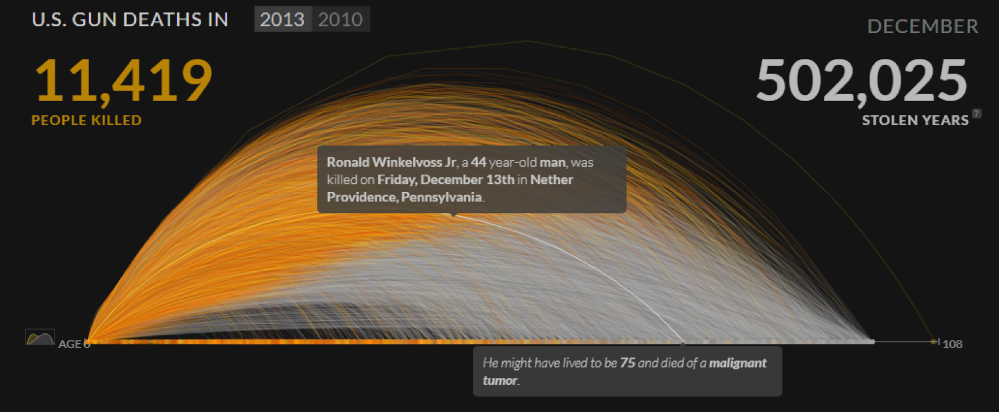

或者查看实际年龄和预测年龄的分布，很明显看到的是一个严重两极分化的分布：

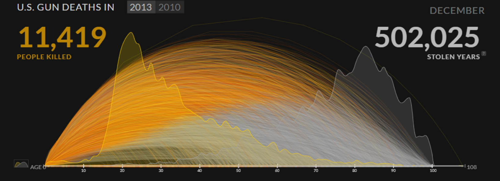

## 六. 什么是好的可视化

迈阿密大学教授Alberto Cairo提出，一个好的数据信息的表达应该遵循以下5个原则：**真实的**，**有用的**，**优美的**，**有见地的**，和**有启发性的**。

### 6.1 真实的（Truthful）

> 第一条原则，你不能欺骗你自己，你是最容易被骗的人。 ——美国物理学家理查德费曼

我们常常容易犯两个错误。一旦有了一个观点或假设，就会竭尽全力的去寻找能支持这个观点的证据，却选择性的忽视否定这个观点的证据，又或者当反对观点出现的时候，我们总会本能的先开始反驳，而不是先考虑其合理性。为了观点而做的可视化是有偏见的，带着观点去解读可视化同样也是有偏见的。除非我们能找到一些数据来佐证我们的观点，否则就不能说“我觉得有就是有”，比如如果问你运动员签了大合同后是否会影响其竞技水平？当然不能说我觉得有不少球员签了大合同后就废了，然后再找一些例子来佐证这个观点。而应该是首先明确多大金额的算是大合同，然后把所有签了这些合同的球员列出来。选择多个综合指标去比较这些球员在签订合同前后的几年间的表现。而且还要排除伤病影响的，是否中间更换过球队，出场时间差别是否过大等等。

### 6.2 有用的（Functional）

比如问一个问题：这个周末商场促销的效果如何？如果只是得出结论促销过程中销售额增长了60%，单看是正确的，但是是不是有用呢？其实没用，而且还有误导的嫌疑。要做到有用，是不是应该包含销售额增长来自哪部分商品？是仅仅来自促销商品？还是也带动了其他商品的销售？ 周末促销是不是应该考虑平时的销售额也是增长的，实际的增长是不是可能没有60%那么高？在停止促销后的几周里，是不是比促销前的几周也做到了持续增长？深入分析并回答了这些问题，我们才应该算是正确回答了“促销是不是达到了效果?”这个问题，这才算是有用的。

### 6.3 优美的（Beautiful）

数据可视化要简洁明了，关键是要把不包含信息的元素去掉，把信息冗余的部分合并掉，用比较优雅的方式表现。数据墨水比越高的可视化图表越优美。

### 6.4 有见地的（Insightful）

信息图是为了给人阅读的，要表达出观点，而不只是给人看看就结束了。不光要表达出来，而且最好是有意义.  而不是让人一看，哇好酷炫！却得不出任何有意义的结论。当然在重点要表达的地方可以用文字，或者其他特别的方式标注出来，方便听众或读者迅速的提取信息。

### 6.5 有启发性的（Enlightening）

做好了前面的4点，我们的数据可视化就是有启发性的。通过数据可视化，读者了解了数据背后发生的原因，以及对未来可能产生的影响。以上就是Alberto所说的关于信息图的五个原则：真实的，有用的，优美的，有见地的，和有启发性的。

## 七. 参考文献
[数据可视化概览](https://antv.alipay.com/zh-cn/vis/blog/vis-introduce.html)
[数据可视化过程不完全指南](https://mp.weixin.qq.com/s?__biz=MzUxOTE5MTY4MQ==&mid=2247484022&idx=1&sn=112aaff32972bd01e67495b54d8586d9&chksm=f9fc2f98ce8ba68ed9de2215c8ed67e28f087295fb8d76a16d4e9fd8e9d56693af1bc4aec676&mpshare=1&scene=1&srcid=091407uSTcCSLnsYTAyWwPk3#rd)
[数据可视化工具目录](https://datavizcatalogue.com/ZH/index.html)
[关于数据可视化](https://mp.weixin.qq.com/s?__biz=MzI2MjQ0NDQzOQ==&mid=2247483742&idx=1&sn=4b07dee2b14fd547fda03fbecdd14701&chksm=ea4a45a6dd3dccb06df1c0d63e2c7d1dd4bf665af6da40aeb5a9272aa17fc2a3251f0f79a3d0&mpshare=1&scene=1&srcid=0607wkCTa104Bo3JJakXtPmV#rd)