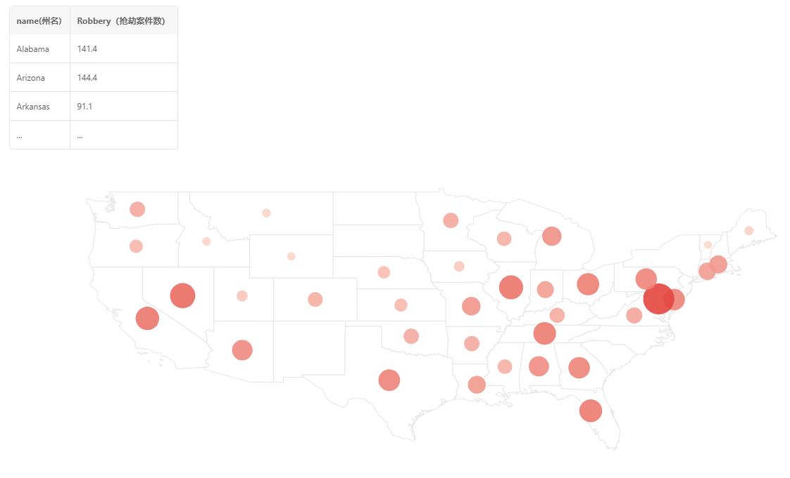
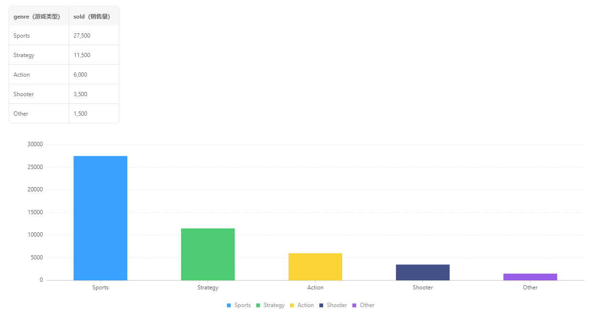
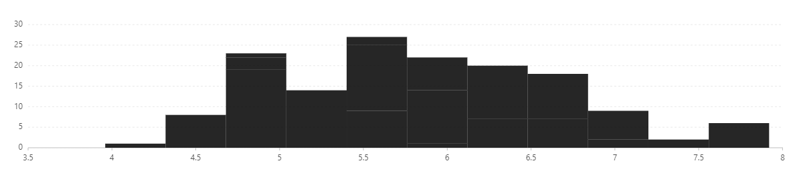
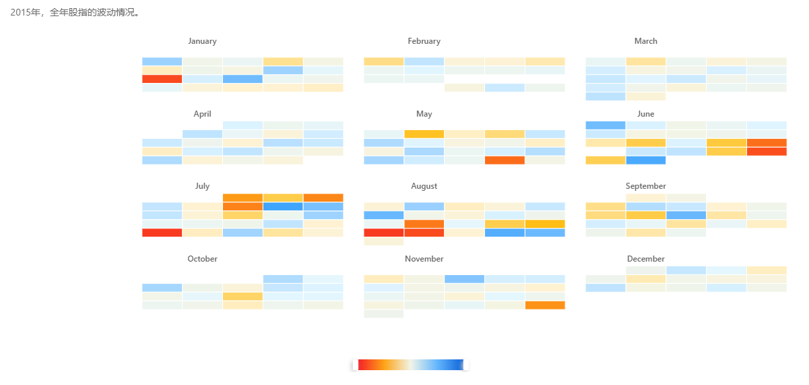
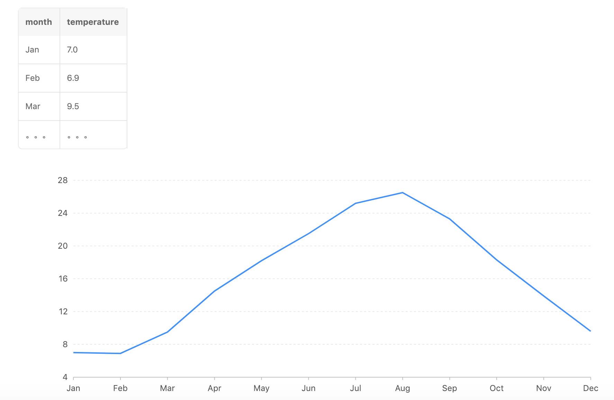

数据可视化入门

数据可视化是数据科学庞大知识体系的一个重要的组成部分。是数据科学成果最终呈现在世人面前的表现形式。因此它发挥的关键作用是不言而喻的。数据可视化（Data Visualization）是将非数字的信息进行可视化以表现抽象或复杂概念、技术和信息的过程。它将数据用各种形式的图表进行呈现，从而传递和展示信息。这篇学习笔记将对数据可视化进行一个简明扼要的介绍，带领大家理解并掌握如何解读数据可视化，如何通过可视化有效地传递信息，以及对于数据可视化的一些思考。

一. 如何解读数据可视化

我们可以把数据可视化看作是“数据空间”向“图形空间”的映射。数据所蕴含的信息以各种图表元素的形式展现了出来。常用的解读数据可视化的4种方法有：比大小，看长短，辨深浅，明趋势。

1. 比大小

视觉编码中的“面积/体积”常常被用来编码数据的某些数值特征，例如下图展示了某年美国各州发生的抢劫案件数目，抢劫案发生的次数就被编码成了图中“气泡”的大小，气泡越大发生的抢劫案越多，从图中可以看到发生次数最多的是Maryland，这种图叫做气泡地图（Bubble Map）。

2. 看长短

人眼对于长度的感受往往是最准确的，因此在可视化图表中长度也是一个很常见的视觉编码元素。这个经常用在一些比较类的图表中，特别是对数据进行计数统计的场景。其中柱状图是最常见的一种：

上图统计了不同种类游戏的销量，通过看长短的方式，一眼就能看出体育类游戏销量最高，其次是即时战略类游戏。另一种需要看长短的图表是直方图，它和柱状图看起来很像，但我们一定要知道它们的区别：柱状图用于统计**分类变量的计数**，比如上面不同类型游戏各自的销量。而直方图是用来展现**连续数值变量的分布**：它首先划分了不同的数据范围，我们称为“分箱”（bins），然后对落在不同分箱中的数据进行计数。例如下图展示了鸢尾花花萼长度的分布，从这个直方图中我们至少可以观察到3点：

1. 花萼长度的分布大概在4到8之间；
2. 花萼长度在5.5左右的属种数量最多；
3. 和柱状图不同的是，直方图各分箱之间没有间隔，表示数值数据是连续的；

3. 辨颜色

可能对于大多数可视化来说，最容易引起注意的就是图表中出现的颜色了。颜色在数据可视化中也扮演了重要的作用。一般来说，数据可视化都是二维的，如果我们要表示更多维度的信息，除了上面提到的长度和面积以外，最常用的就是颜色了。对于分类变量，我们可以把不同的类别编码为不同的颜色；对于连续型数值变量，我们可以把数值编码为色谱（color spectrum），用颜色的变化表示数值的变化。比如下面这个图展示了2015年，全年股指的波动情况。该图将某月的星期几映射到x轴，第几个星期映射到y轴，股指映射到颜色，从冷色调的蓝到暖色调的红，表示股指从低到高，并按照全年12个月进行分面（facets）。

4. 明趋势

数据点在图表中所处的位置往往也暗示了想要表示的信息。我们可以从这样的图表中读取数据的变化趋势信息，这在分析某时间段内数据趋势或变化时很常见，比如下面这个折线图分析了不同月份气温的变化趋势，可以看到气温从一月开始慢慢上升，到八月后九月前达到顶峰，随后开始下降，一直到12月。

5. 视觉编码：图表要传递的信息

以上介绍的只是众多视觉编码中的4种而已，按照有效性从高到低的顺序排列，常见的视觉编码有：

1. 位置
2. 长度
3. 弧度
4. 方向
5. 面积/体积
6. 形状
7. 色彩和饱和度

二. 如何有效地传递信息

数据可视化的目的是为了传递信息，要正确的传递信息，首先是根据要展示的信息选择合适的图表。在绘制图表的过程中我们还要注意一些设计方法和技巧，最后，我们应该把所有的图表集合起来，以一种有效的方式串联成一个故事讲给读者听。

1. 选择图表类型

用简单的三个步骤就可以选择合适的图表类型：一看数据类型，二看数据维度，三看要表达的内容。

我们有两种数据类型，每种数据类型又有两个子类别。首先，我们有**分类数据**和**定量数据**。分类数据用来表示类别，比如苹果，香蕉，梨子和葡萄，就是水果的4种类别，称为**分类定类**；有的分类变量是有一定顺序的，比如可以把红酒的品质分为低，中，高三档，人的身材有偏瘦，正常和肥胖等等，这种特殊的分类变量称为**分类定序**。定量数据也可以进一步分为两类，一类叫**连续值数据**，比如人的年龄；一类叫**离散值数据**，比如猫咪的数量。选择图表的第一步就是要看我要展示的数据是什么类型，最典型的例子就是相关性分析，如果要分析定量数据和定量数据之间的关系，那么散点图无疑是最佳选择，但如果有其他情况出现该怎么选择呢？数据类型直接影响你能选择的图表类型：

* 分析分类数据和分类数据之间的相关性：马赛克图
* 分析分类数据和定量数据之间的相关性：柱形图或箱线图

看完了数据类型，接着看维度，要展示的数据是一维，二维还是多维的？如果是一维或者二维，那么一般的统计图表都能满足要求，但如果我们有多维的数据，我们就要把第三维开始的数据映射到上面提到的那7大视觉编码中。比如散点图表示了两个定量数据之间的关系，如果还存在第三个定量数据，那么我们就可以用点的大小来表示，那么散点图就变成了气泡图，如果第三个数据是分类数据，那么我们可以在散点图的基础上标记颜色来表示。

最后，还要考虑可视化主要想表达的内容是什么。对于4大内容：比较，分布，组合和关系，下面这张图给出了一份简单的指南。比如我想表达的是数据的分布，如果是单变量且只有比较少的数据点时，可以选择直方图。

2. 少即是多：数据墨水比

选择了正确的图表并绘制完成，下一步我们要做的就是对绘制的图表进行检查：它是否有效的传递了信息？评判的标准叫做数据墨水比（data-ink ratio），即用于描述数据的墨水量/用于描述所有其他东西的墨水量。这里的墨水量可以理解为使用的视觉编码元素量。数据墨水比越高表示图表越有效，说明图表中用来描述数据的视觉编码数量占比很高，反之则很低。比如下面这张图：

这个图表充斥了大量无效的视觉特效：各种纹理，背景，立体阴影效果以及字体加粗，花费了大量的墨水用在与传达信息无关的视觉编码上。使读图的人无法快速地获取图表想要表达的信息，数据墨水比非常的低。而经过改造之后，我们去掉了各种纹理背景，去掉了各种坐标轴，直接将数值显示在柱状图上，然后对文字进行淡化，并用颜色突出显示我们想要读者一眼就看到的类别（培根），去掉了一切立体和阴影的效果，得到的图表如下所示，怎么样，是不是比上面这个图表要清晰很多呢？Less is more effective!

最后要提醒大家的一点是，使用颜色一定要小心，你要充分的考虑数据可视化的受众，比如红色和绿色对于红绿色盲的患者就是很不友好的。

3. 超越单图：怎样做一个Storyteller

三. 一些思考
1. 好的数据可视化有什么特点
2. 可视化在数据科学中的位置