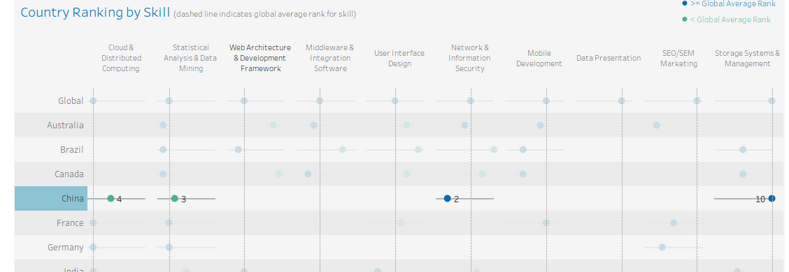
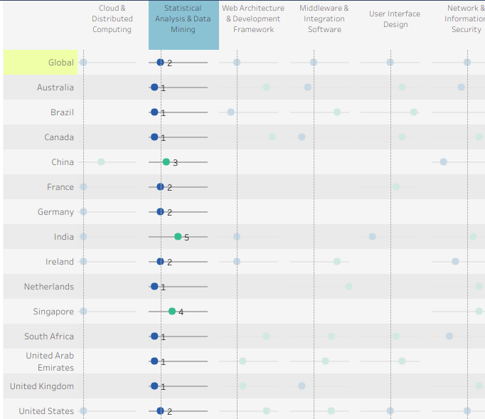
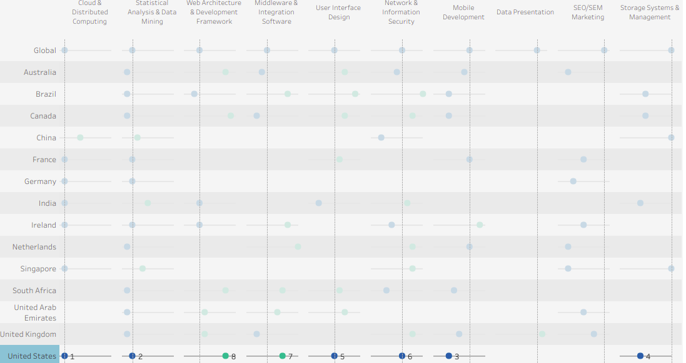

# My Data Visualization Interpretion About LinkedIn Top Skills

## 1.

The skill of network and information security ranked most in 2016 in China. Among the countries I click China, the data shows that skill of network and information security is most wanted in 2016 by employers, ranked 2, higher than global ranking of 6. 

## 2.

The skill of statistical analysis and data mining ranked 1st in country Australia, Brazil, Canada, Netherlands, South Africa, United Arab Emirates and United Kingdom. I click statistical analysis & data mining in dashboard, data shows that in all countries mentioned above, this kind of skill ranked 1st, meaning that it is most wanted by employers in these countries.

## 3. 

The skill of cloud & distributed computing ranked 1st in United States. I click the country United States in dashboard, data shows that among all the skills, cloud & distributed computing is most wanted in United States.

