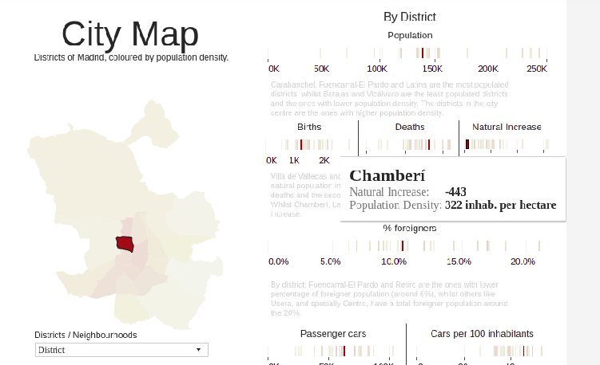
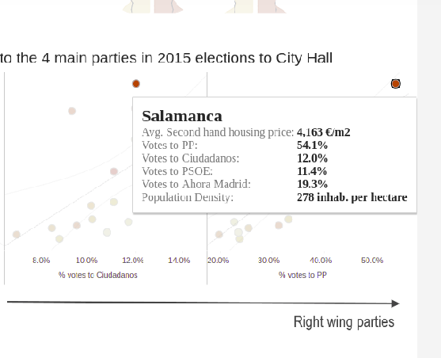
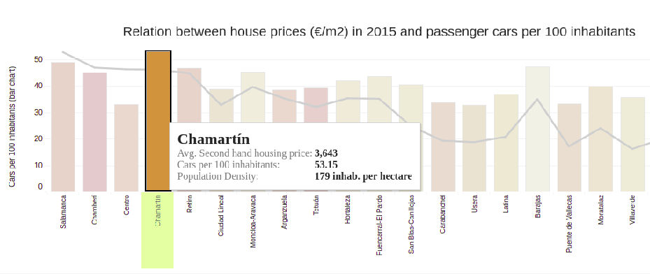

# My Data Visualization Interpretion About Madrid

## 1. 

Chamberi has the most population density while natural increase is minus. In the city map I clicked Chamberi, this area has the darkest color, meaning that it has the most population density, however, from the right it can be found that births is less than deaths, so the natural increase is negative, about -443.

## 2.

Inhabitants in Salamanca vote the most to PP. In relation between house prices and votes in 2015 I click the right-most point in the right-most subplot(votes to PP), data shows the votes of Salamanca to the four parties, at the peak of house prices, inhabitants in Salamanca votes 54.1% to PP, beyond half of it.

## 3.

Inhabitants in Chamartin have the most passenger cars per 100 inhabitants. In relation between house prices and passenger cars per 100 inhabitants, I click Chamartin with the longest bar, data shows that this area has the most cars per 100 inhabitants, nearly 53.15. 

