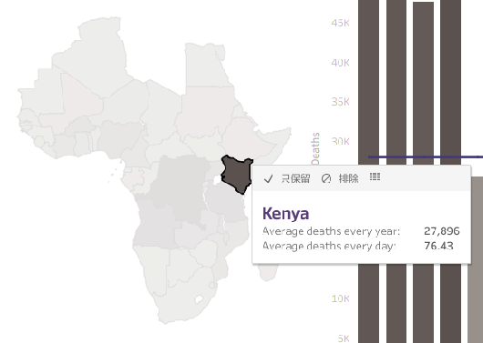
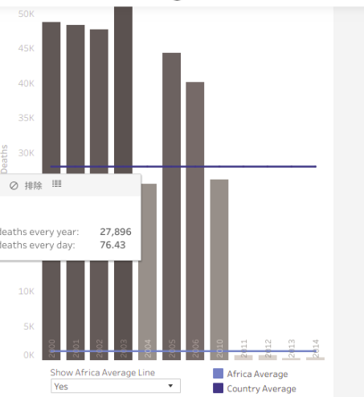
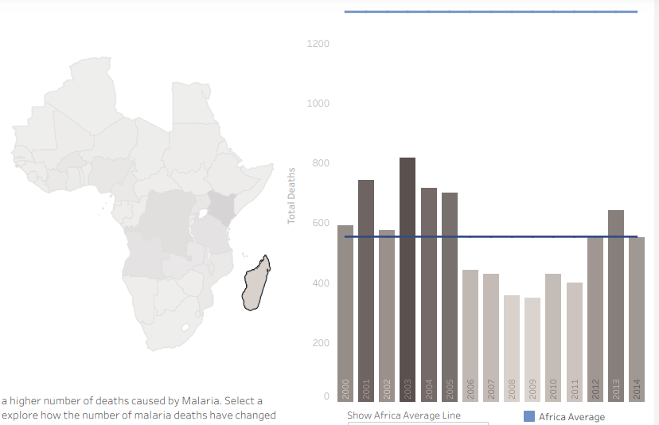

# My Data Visualization Interpretion About Malaria Deaths in Africa 2000-2014

## 1.

Kenya suffers the most from malaria. In the map of Africa I click the country with the darkest color, finding that Kenya suffers the most. The data shows that malaria causes 27896 deaths in average per year, abount 76.43 deaths in average per day from 2000 to 2014.

## 2.

Deaths caused by malaria in Kenya drops a lot since the year 2011. In the map of Africa I click the counry Kenya, from the bar plot on the right, the data shows that the deaths drops greatly from above 25000 in 2010 to hundreds since 2011.

## 3.

Deaths caused by malaria in Madagascar are below Africa average. In the map of Africa I click the island on the right down corner, finding that it is Madagascar! the bar plot on the right shows that average deaths caused by malaria in Madagascar are always less than 900 in average per year, far below Africa average.

