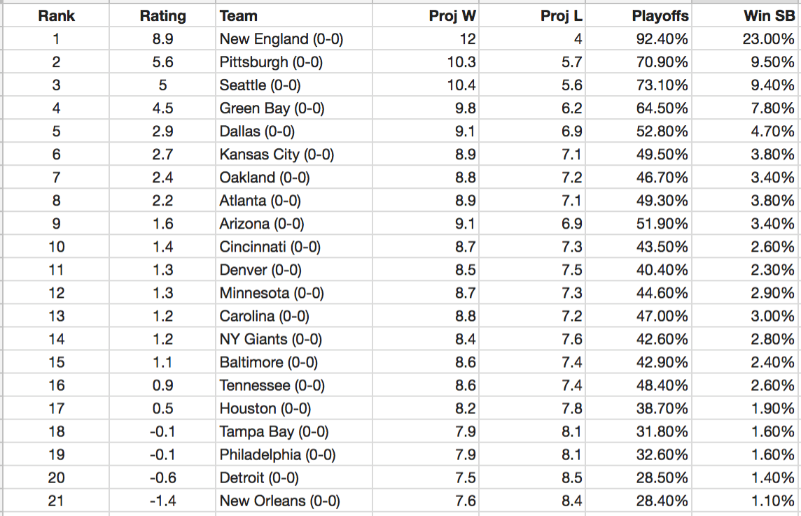

## 一．NFL 球队预测排名

以下是根据电子表格应用程序中显示的 球队排名 的 NFL 球队排名数据标头。在第一个实战项目中，你将要面对大量的电子表格。现在，看看你是否能够理解关于这些数据的基础知识。
同样，在项目的这一部分，你不需要交付任何内容，这里只是显示了一个电子表格的应用。
电子表格用于存储、分析与呈现数据，适用于多个行业。下面是在电子表格中存储数据的一个示例。




### 1. 在每个team名称旁边你可以看到球队比赛记录那么哪支球队的比赛记录最好呢?

1. Arizona
2. Minnesota
3. Carolina
4. Detroit
5. None of the Above

### 2.为每支球队匹配描述该球队的恰当数据

| 数据      | 答案 |
| ----------- | ----------- |
| Project 12 Wins（预计12胜）|    X   |
| Playoff Win（季后赛胜率）为49.5%   |    X     |
| Rank 13   |    X     |
| 0-0记录   |    X     |


1. 没有一直队赢。
2. Cincinnati
3. New England
4. Kansas City
5. Carolina
6. All of them.

## 二. 天气数据

天气对农民的收成影响巨大。为了了解在本项目后面深入学习的工具，你将使用 SQL 与下面的环境从最接近你的城市中提取数据。

处理多个电子表格中的大量数据时，最好将数据移动到 SQL 数据库中。 SQL 代表结构化查询语言，它可以快速执行 Excel 的多个任务。此外，SQL 可以同时处理多个电子表格。大部分公司主要依靠数据库来存储与组织他们的数据。能够通过熟练编写 SQL 查询命令来访问与分析数据库中的数据，这是数据分析师的基本技能。根据 Apple 分析经理的说法，在专业技能方面，“ SQL 技能是所有技能中最重要的一项技能”。

运行下面的代码

```SQL
SELECT *
FROM city_list;
```

你应该会看到下面列出的城市与国家/地区列表。 你刚刚运行了第一个 SQL 查询！目前的列表中，城市是按城市字母顺序排列的，但如果按国家/地区排序，则可能更容易找到距离你最近的城市。

尝试运行以下环境中的代码，从而实现更改你的查询命令要更改的列。

```SQL
SELECT *
FROM city_list
ORDER BY country;
```

找到距离你最近的城市后，请尝试更改以下代码，从而获取你所在城市和国家/地区的天气数据。下面是我自己的代码，你可以将San Jose与United States改为另一个城市，或者离你最近的城市！请注意，在SQL中，引号是非常重要的符号，你需要在城市和国家/地区名称前后加上引号。

```SQL
SELECT *
FROM city_data
WHERE city = 'San Jose' AND country = 'United States';
```
