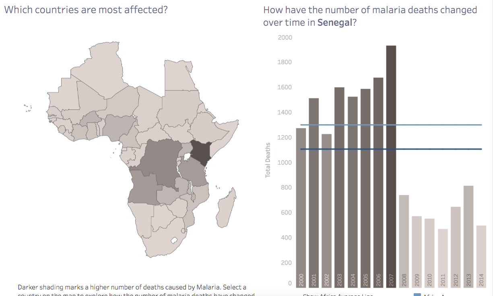

## 项目描述

数据分析工作的很大一部内容是能够向别人解释数据可视化，并阐述你的见解。为了让你做一些练习，我们选择了一些 Tableau 仪表板供你练手，具体链接如下。要完成本项目，你需要：

1.	请选择 其中一个 你最感兴趣的仪表盘 (dashboard)。
2.	在对应仪表盘中的可视化中找出 三条见解。
3.	对于每条见解，请提供静态图像，分享你的观察发现。写一份简短的报告，解释你的每次发现以及你是如何在报表中找到能够得出你的结论的信息。
4.	包括图像，你的报告长度应该为1-2页。

## 项目审阅标准

该项目的审阅标准链接： https://review.udacity.com/#!/rubrics/2100/view

屏幕截图

你可以将图像复制并粘贴到你的报告中。

## 示例

你的见解或结论可以是类似这样的：

 > “自2007年以来，塞内加尔每年因疟疾导致的死亡人数减少了一半。在该报表上，我点击了地图上的塞内加尔，上面的数字显示了2000年至2014年每年因疟疾而死亡的人数。2007年之前，每年大约有1400-1500人死亡。2007年之后，也就是从2008年开始，每年的死亡人数减少到了约600-700人。”

以PDF格式提交此报告。所有图像和结论都应该在一个 PDF中，每个结论后面必须有一个关于该结论的图像。

从下列仪表板中选择一个你最感兴趣的仪表板：
1. [Madrid in Detail](https://public.tableau.com/en-us/s/gallery/madrid-details?gallery=featured)
2. [Malaria in Africa](https://public.tableau.com/en-us/s/gallery/malaria-africa?gallery=featured)
3. [LinkedIn Top Skills](https://public.tableau.com/profile/matt.chambers#!/vizhome/LinkedInTopSkills2016-MakeoverMonday/LinkedInTopSkills2016-MakeoverMonday)

如果你选择使用LinkedIn 数据，可以阅读[这篇文章](https://blog.linkedin.com/2016/10/20/top-skills-2016-week-of-learning-linkedin) ，它对你形成见解或结论很有帮助。

