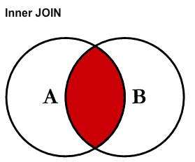
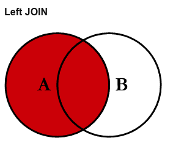
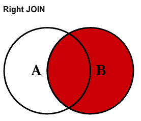
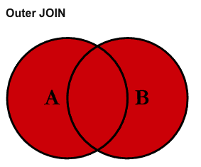

# 一. 数据库与SQL语言简介简介

## 1.1 SQL：与数据库交互的语言

SQL的全称是结构化查询语言（Structured Query Language）。它属于领域特定语言（Domain Specific Language）范畴，用于管理关系型数据库管理系统。SQL基于关系代数理论建立的，包括数据定义语言和数据操纵语言。SQL的范围包括数据插入，查询，更新和删除，数据库模式创建和修改，以及数据访问控制。

一般来说，我们会将数据按照一定的范式进行设计，然后将其设计为具有相互联系的表格，然后将其存放到数据库中。能够被这样设计的数据，我们称为“结构化数据”。还有一些数据是无法结构化的，我们称为非结构化数据，比如图像，视频和音频等等。

除了后端开发工程师要跟数据打交道，SQL也是数据分析师必备的基础技能之一。SQL语义容易理解，分析师可以直接访问数据，不需要拿个U盘拷来拷去。数据存放在数据库中易于审核和复制。分析师可以通过复杂的查询语句一次查询和分析多个表，分析更复杂的问题。企业使用SQL则可以进行数据完整性检查，可以快速访问数据。而且企业的多个团队可以并发使用，容易共享有价值的数据。有[大量的工作](https://www.zippia.com/advice/what-jobs-use-sql/)要用到SQL技能，Top 10有：

1. 商业分析师
2. 高级软件工程师
3. 高级SQL Server数据库管理员
4. 质量保障测试
5. 网络开发者
6. 系统管理员
7. 软件工程师
8. SQL Server开发者
9. 质量保障分析师
10. 高级Oracle数据库管理员
		
那么DB是如何存储数据的呢？数据被存储于类似Excel电子表格的表中，同一列中所有数据必须是同一数据类型，这样有助于实现快速访问数据。业界流行的DB有：

1. MySQL
2. Oracle
3. Microsoft SQL Server
4. Postgres
5. SQLite

## 1.2 重要概念：实体关系图
实体关系图（ERD）是查看数据库中数据的常用方式。数据库中的表并不是孤立的，相互之间会通过主键-外键建立联系。这些图可以帮助你可视化正在分析的数据，它包括三个元素：

1. 表的名称
2. 每个表中的列名
3. 表配合工作的方式，即主键和外键之间的对应关系


在开始查询数据前通过ERD图理解数据库表之间的关系，有助于使用SQL语言进行各种复杂的查询，解决各种复杂的问题。上图为课程中用到的Parch & Posey数据库。这是一家销售纸张的虚构公司，销售普通纸，海报纸和铜版纸。他们有些客户，都是通过在线广告招徕的：

1. web_events：在线广告渠道数据
2. accounts：客户数据
3. orders：订单数据
4. sales_reps：销售代表数据
5. region：销售区域数据

ERD使用[Crow's Foot Notation](https://www.vertabelo.com/blog/technical-articles/crow-s-foot-notation)来表示表之间的关系。PK的意思是Primary Key，即主键，FK表示Foreign Key，即外键。某个表的主键是另一个表的外键，比如accounts表中的主键id就是orders表中的外键account_id，意味着我可以通过这个关联查找某个客户的订单数据。复杂的数据查询就是这么建立起来的，下面我们就以这个数据库为例，分三个阶段，由浅入深入门SQL语言。
	
# 二. SQL语言入门	

## 2.1 基本的SQL查询

SELECT语句是SQL中的查询语句。其基本语法格式为：

```SQL
SELECT 逗号分隔的列名列表 FROM 表名;
```

例如，从订单表（orders）中查询id和发生时间（ocurred_at），则可以这么写：
```SQL
SELECT id, occurred_at FROM orders;
```

如果想要查询所有的列，也可以不用显式地列出字段集的名字，而是用*号代替。FROM子句用于指明数据的来源，即表名。

关于SQL语句的格式，这里还要特别说明一下。对于SQL命令（SELECT，FROM），我们选择大写，而其他内容比如列名选择小写。SQL本身并不区分大小写，然而适当的用大小写来区分命令和其他内容，能够增加SQL语句的可读性。另外表和变量名的命名不要有空格，用下划线来代替。每个SQL语句写完之后要写一个分号。关键字的顺序也很重要，有时候写错顺序，SQL在执行的时候就会报错。

这里推荐一种以SQL命令开头的写法。这种写法以多行完成一个SQL语句。能够进一步提高可读性：
```SQL
SELECT account_id
FROM orders;
```
对于做后端开发的同学而言，还有一种最佳实践，是给字段加上反引号，这么做是因为SQL是不区分大小写的，万一不小心列名与SQL的某个关键字重复了，使用反引号能指明这是列名，而不是关键字，能够避免SQL执行错误：

```SQL
SELECT `id`, `account_id`
FROM orders;
```

查询语句中还有其他一些比较常见的子句，这些子句是可选的，但这些可选的子句很多时候能够make your life much better。下面我们就来一一介绍一下。

### 2.1.1 LIMIT

LIMIT子句用于查询前几行。有时候我们查询某个表格只是为了观察下它有哪些列，并不需要全部查询出来，特别是表格数据量很大的时候，如果像上面那样编写会输出全部的数据，滚屏输出要花很长时间，使用LIMIT子句，我们可以只查看前5行：

```SQL
SELECT id, account_id 
FROM orders
LIMIT 5;
```

### 2.1.2 ORDER BY

ORDER BY子句可使我们按任意顺序对查询结果进行排序。默认的排序是升序，如果需要降序排列，则可以在之后添加DESC，比如查看最新的10个订单数据，可以这么写：

```SQL
SELECT *
FROM orders
ORDER BY occurred_at DESC
LIMIT 10;
```

ORDER BY子句可以实现多列排序。比如想要将查询结果先按照账户进行排序，然后对于每个账户的订单数据从大到小排序。这样就能迅速看出每个账户最大的一笔订单了：

```SQL
SELECT account_id, total_amt_usd
FROM orders
ORDER BY account_id, total_amt_usd DESC;
```
注意这里排列的顺序很重要，这里的DESC只对total_amt_usd起作用。

### 2.1.3 WHERE

用于在查询时指定结果集必须满足的条件。相当于使用筛选功能。WHERE 语句中使用的常用符号包括：
1. \>（大于）
2. <（小于）
3. \>=（大于或等于）
4. <=（小于或等于）
5. =（等于）
6. !=（不等于）

举例，查询某个客户（ID=4251）最新的10个订单数据：
```SQL
SELECT *
FROM orders
WHERE account_id = 4251
ORDER BY occurred_at
LIMIT 10;
```
比较运算符可以与非数值数据字段一起使用。我们可以使用`=`和`!=`，分别表示“等于”和“不等于”，文本数据注意使用单引号。举例，查询名称为United Technologies的客户资料信息：
```SQL
SELECT *
FROM accounts
WHERE name = 'United Technologies';
```

### 2.1.4 算术运算符

还可以通过算数运算符，将现有的列进行组合，得到派生列。常见运算包括：

1. *（乘法）
2. +（加法）
3. -（减法）
4. /（除法）

与在做数据分析时根据已有特征创建新特征是一个道理。使用派生列的时候需要对它进行命名，可以使用AS命令。举例，从订单数据中查询账户名，时间，标准纸购买数量，铜版纸购买数量，海报纸购买数量和**非标准类纸购买数量**（即铜版纸和海报纸数量之和）：

```SQL
SELECT account_id, 
  occurred_at, 
  standard_qty, 
  gloss_qty, 
  poster_qty, 
  gloss_qty + poster_qty AS nonstandard_qty
FROM orders;
```

### 2.1.5 逻辑运算符

逻辑运算符包括：

1. LIKE：模糊查找和模糊匹配
2. IN ：用于多个条件的情况，相当于从某个集合中选取
3. NOT：这与 IN 和 LIKE 一起使用，用于选择 NOT LIKE 或 NOT IN 某个条件的所有行
4. AND & BETWEEN：可用于组合所有组合条件必须为真的运算
5. OR：可用于组合至少一个组合条件必须为真的运算。

LIKE运算符用于处理文本，我们经常在WHERE子句中使用。LIKE运算符经常与`%`一起使用。后者相当于通配符，表示任意数量的任意字符。举例：查询引用页URL中包含“google”的数据：
 ```SQL
SELECT *
FROM web_events
WHERE referrer_url LIKE '%google%';
```

IN运算符用于从若干可能的值集合中筛选数据。比如如果我们只想看沃尔玛和苹果公司的账户信息，可以这么查询：

```SQL
SELECT *
FROM accounts
WHERE name IN ('Walmart', 'Apple');
```

NOT 可以与之前介绍的两个运算符 IN 和 LIKE 一起运算。可以查找到所有不符合特定条件的行。举例，查找除321500和321570以外的其他销售代表：

```SQL
SELECT sales_rep_id, name
FROM accounts
WHERE sales_rep_id NOT IN (321500, 321570)
ORDER BY sales_rep_id;
```
或者查找引用页URL中不包含“google”的数据：
```SQL
SELECT * 
FROM web_events
WHERE referer_url NOT LIKE '%google%';
```

AND运算符表达逻辑与运算，用于 WHERE 语句中，可一次性同时满足多个逻辑子句。使用 AND 语句进行连接时要指定感兴趣的列。比如查询2016年4月1日后，2016年10月1日前的订单数据：
```SQL
SELECT * 
FROM orders
WHERE occurred_at >= '2016-04-01' AND occurred_at <= '2016-10-01'
ORDER BY occurred_at DESC;
```

可以用BETWEEN运算符改写，请参考：
```SQL
SELECT * 
FROM orders
WHERE occurred_at BETWEEN  '2016-04-01' AND  '2016-10-01'
ORDER BY occurred_at DESC;
```

与 AND 运算符类似，OR 运算符可以组合多个语句。但是与AND不同，OR组合的多个条件中只至少有一个满足即可。比如从订单数据中查询不是三种纸张都采购的订单：

```SQL
SELECT account_id, 
  occurred_at, 
  standard_qty, 
  gloss_qty, 
  poster_qty
FROM orders
WHERE standard_qty = 0 OR gloss_qty = 0 OR poster_qty = 0;
```

SQL的基本用法就介绍到这里。但SQL的强大远不止如此。对于比较复杂的分析问题而言，我们需要进行更复杂的连表查询才能回答。因此下面我们来重点研究下如何使用SQL进行表连接复杂查询。

## 2.2 SQL的JOIN运算

SQL的强大之处在于它可以同时处理多张表格。关系型数据库中的表都是相互联系的，我们需要通过表连接运算从多个表格中整合信息。

为什么关系型数据库要分表，有多种原因。其中一个重要原因是我们可以把表中每一行的数据看作一个对象，而对象是有不同类型的，比如订单和账户就是不同类型的数据（对象），分开的话更容易组织。另外，多表格结构可以保证更快的查询。创建数据库并进行表格设计时，一定要思考如何存储数据。设计新的数据库要理解数据库的**规范化**：

1. 表格存储了逻辑分组的数据吗？
2. 我能在一个位置进行更改，而不是在多个表格中对同一信息作出更改吗？
3. 我能快速高效地访问和操纵数据吗？

[这篇文章](https://www.itprotoday.com/database-performance-tuning/sql-design-why-you-need-database-normalization)详细介绍了与数据库规范化设计有关的知识。

### 2.2.1 INNER JOIN
我们先看看被称为INNER JOIN的内连接运算。后面我们还会接触其他类型的连接运算。无论什么类型的连接运算，它们的目标都是一次性从多个表格中获取数据，所以你可以把JOIN看作是第二条FROM子句。比如我们要连表查询，匹配的条件是accounts表中的id字段和orders表中的account_id字段：

```SQL
SELECT orders.*, accounts.*
FROM orders
JOIN accounts
ON orders.account_id = accounts.id;
```
那么这个查询的目的是什么呢？它的目的是同时从orders和accounts表中查询数据，既然是两个表的数据共同构成的结果集，那每条结果总要以一定的条件拼接在一起，条件就是：orders表中的account_id与accounts表中的id相等。

如果重新翻看一下前面提到的实体关系图，我们就能发现，accounts表中的id是主键，它对应orders表中的account_id列，是外键。**主键**是特定表格的唯一列，**外键**是另一个表格中的主键。如果想要连接更多的表格，同样可以采取相同的逻辑：

```SQL
FROM web_events
JOIN accounts
ON web_events.account_id = accounts.id
JOIN orders
ON accounts.id = orders.account_id
```
连表查询时一个突出的问题是经常要打出多个表格的全名，写出来的语句往往又很复杂，这样会很累。我们完全可以在写连表查询语句时使用表的别名缩写，让我们的工作轻松些：
```SQL
SELECT o.*, a.*
FROM orders o
JOIN accounts a
ON o.account_id = a.id;
```

### 2.2.2 其他类型的JOIN

除了INNER JOIN，我们还有OUTER JOIN运算。OUTER JOIN又分为左连接LEFT JOIN和右连接RIGHT JOIN。要理解它们的区别，需要从集合论的角度去理解，别忘了，我们的关系型数据库是基于关系代数理论构建的。INNER JOIN运算实际上只会返回两个表格中都有的行，也就是求交集运算，如下图：



如果我们要查询的数据并未同时存在与多张表格中，就要用到外连接运算。要理解其他类型的连接运算，首先要学会区分左表和右表的概念：
```SQL
SELECT
FROM left table
LEFT JOIN right table
```
直接看韦恩图就能明白左连接和右连接的区别了，其实就是包含的元素比内连接多了一些：





其实还有一种被称为FULL OUTER JOIN的：



数据分析中常用的连接运算就这些。如果你想更深入理解SQL提供的丰富的连接运算，那么首先你可以学习一下[SQL的各种JOIN](https://www.codeproject.com/Articles/33052/Visual-Representation-of-SQL-Joins)，然后你可能要理解[为什么不能有多对多的关系](https://stackoverflow.com/questions/7339143/why-no-many-to-many-relationships)，以及[完全外连接](https://www.w3resource.com/sql/joins/perform-a-full-outer-join.php)和[完全外连接罕见用法](https://stackoverflow.com/questions/2094793/when-is-a-good-situation-to-use-a-full-outer-join)，以及一些比较特殊的连接运算，比如[CrossJOIN](http://www.sqlservertutorial.net/sql-server-basics/sql-server-cross-join/)和[SelfJOIN](http://www.sqlservertutorial.net/sql-server-basics/sql-server-self-join/)。另外，[SQL JOIN可视化](https://www.codeproject.com/Articles/33052/Visual-Representation-of-SQL-Joins)也是不错的资源。

## 2.3 SQL的聚合运算
学会了连表查询，下面我们可以真正开始用SQL语句来进行基于聚合运算的数据分析了。熟练掌握了这些技能，我们以后就能做知识迁移。当你在使用Python的pandas库进行数据分析，或者使用Spark进行分布式数据分析时，你会遇到一些和这里介绍的知识似曾相识的概念。你会触类旁通很快掌握。

### 2.3.1 计数运算
COUNT运算可以计算某列一共有多少行。但我们要注意SQL中的一种数据类型：NULL，它表示没有数据，它们经常在聚合函数中被忽略，这个一定要注意。比如COUNT运算就只计数不为NULL的项。举例，计算accounts表格中有多少行数据：

```SQL
SELECT COUNT(*)
FROM accounts;
```

### 2.3.2 求和运算

与 COUNT 不同，我们只能针对数值列使用 SUM，因为求和本身只对数值才有意义。注意SUM会将NULL值当作0处理。举例，统计每种纸张类型的总销量：

```SQL
SELECT SUM(standard_qty) AS standard,
  SUM(gloss_qty) AS gloss,
  SUM(poster_qty) AS poster
FROM orders;
```

### 2.3.3 最值运算
最值运算有两种，MIN表示求最小值，MAX表示求最大值。比如我们要统计订单中每种纸张类型的最大购买量和最小购买量：

```SQL
SELECT MIN(standard_qty) AS standard_min,
  MIN(gloss_qty) AS gloss_min,
  MIN(poster_qty) AS poster_min,
  MAX(standard_qty) AS standard_max,
  MAX(gloss_qty) AS gloss_max,
  MAX(poster_qty) AS poster_max
FROM orders;
```

MIN和MAX与COUNT相似，它们都可以用在非数字列上。MIN将返回最小的数字、最早的日期或按字母表排序的最之前的非数字值，具体取决于列类型。MAX则正好相反，返回的是最大的数字、最近的日期，或与“Z”最接近（按字母表顺序排列）的非数字值。

### 2.3.4 均值运算

AVG运算返回的是数据的平均值，即某数值列之和除以数量。该聚合函数会忽略分子和分母中的NULL值。举例，统计各种类型纸张的平均销量：

```SQL
SELECT AVG(standard_qty) AS standard_avg,
  AVG(gloss_qty) AS gloss_avg,
  AVG(poster_qty) AS poster_avg
FROM orders;
```

### 2.3.5 分组聚合

上述聚合函数真正厉害的地方在于它们可以和分组运算结合起来。把数据按照某些条件进行分组然后进行组内聚合运算。GROUP BY运算可以创建在聚合运算时相互独立的分组。要注意，SELECT语句中没有被聚合的字段都应该显式出现在GROUP BY中，比如我们要按照account_id来分组统计不同类型纸张的购买量：

```SQL
SELECT account_id,
  SUM(standard_qty) AS standard_sum,
  SUM(gloss_qty) AS gloss_sum,
  SUM(poster_qty) AS poster_sum,
FROM orders
GROUP BY account_id
ORDER BY account_id;
```
我们还可以用多列分组的方式，把数据切割称更细粒度的数据块。举例：统计每个账户ID的每个渠道事件：

```SQL
SELECT account_id,
  channel,
  COUNT(id) AS events
FROM web_events
GROUP BY account_id, channel
ORDER BY account_id, channel;
```

### 2.3.6 唯一值

DISTINCT可用于仅返回特定列的唯一值的函数。比如，检查每个客户是不是对应了多个渠道：

```SQL
SELECT DISTINCT account_id,
  channel
FROM web_events
ORDER BY account_id;
```

### 2.3.7 聚合列的条件判断函数
HAVING之于GROUP BY，就好比WHERE之于FROM。对于聚合创建的查询中的元素执行WHERE条件时，就要用到HAVING。HAVING总是紧随GROUP BY语句之后，总是与聚合函数一起使用，是聚合字段条件筛选。举个例子，查询所有销售额超过25万的账户：

```SQL
SELECT account_id, SUM(total_amt_usd) AS total_amt_usd
FROM orders
GROUP BY 1
HAVING SUM(total_amt_usd) > 250000
ORDER BY 2 DESC;
```

### 2.3.8 日期运算

在 SQL 中，直接按照日期列分组聚合通常不实用，因为很多情况下这些列可能包含小到一秒的交易数据。按照如此细粒度的级别保存信息，直接分组聚合就没有意义了。有很多 SQL 内置函数可以帮助我们改善日期处理体验。在数据库中，日期一般是按照YYYY-MM-DD HH:MM:SS的格式存储的。

**DATE_TRUNC**函数能够将日期截取到日期时间列的特定部分。常见的截取依据包括`日期`、`月份` 和 `年份`。[这篇文章](https://blog.modeanalytics.com/date-trunc-sql-timestamp-function-count-on/) 详细介绍了此函数的强大功能。

**DATE_PART** 可以用来获取日期的特定部分，但是注意获取 `month` 或 `dow` 意味着无法让年份按顺序排列。而是按照特定的部分分组，无论它们属于哪个年份。要了解其他日期函数，请参阅[这篇介绍](https://www.postgresql.org/docs/9.1/static/functions-datetime.html)文档。

举例，按天汇总标准纸张的数量：
```SQL
SELECT DATE_TRUNC('day', occurred_at) AS day,
  SUM(standard_qty) AS standard_qty_sum
FROM orders
GROUP BY DATE_TRUNC('day', occurred_at)
ORDER BY DATE_TRUNC('day', occurred_at);
```

### 2.3.9 条件运算
SQL中的CASE语句就相当于其他语言中的IF语句，按照WHEN-THEN-ELSE-END的格式书写。举例，根据订单大小给订单打分组标签：

```SQL
SELECT account_id, 
  occurred_at, 
  total,
  CASE WHEN total > 500 THEN 'Over 500'
             WHEN total > 300 THEN '301 - 500'
             WHEN total > 100 THEN '101 - 300'
             ELSE '100 or under' END AS total_group
FROM orders;
```	

在CASE的基础上进行聚合举例，将订单分为总销售额超过500和500及以下的分组：

```SQL
SELECT CASE WHEN total > 500 THEN 'Over 500'
                          ELSE '500 or under' END AS total_group,
               COUNT(*) AS order_count
FROM orders
GROUP BY 1;
```

## 2.4 SQL子查询和临时表
SQL还有一种更高级的应用，是从已得到的查询结果中再进行查询，被称为子查询。子查询的使用比较灵活，可以用在各种子句中：表名，列名，单个值，条件逻辑等等。

编写子查询时，要学会把复杂的步骤拆分成几个不同的部分。比如要计算出每个渠道每天的平均事件数，我们要把这个任务拆分成两个部分：首先查询得到第一个表格，提供每个渠道每天的事件次数；然后再在这个表格上进行第二次查询，对这些值求平均，先写出第一个查询
```SQL
SELECT DATE_TRUNC('day', occurred_at) AS day,
               channel,
               COUNT(*) AS event_count
FROM web_events
GROUP BY 1, 2
```
可以直接运行一下上述查询，看下得到的中间结果是不是自己想要的。然后在这个的基础上写出第二个查询：
```SQL
SELECT channel, 
               AVG(event_count) AS avg_event_count
FROM
(SELECT DATE_TRUNC('day', occurred_at) AS day,
               channel,
               COUNT(*) AS event_count
FROM web_events
GROUP BY 1, 2
) sub
GROUP BY 1
ORDER BY 2 DESC;
```
子查询实际上可以在很多地方用到。它可以用在任何地方，甚至条件逻辑。比如，想要查询与首个订单相同月份的订单，我们来一步一步的计算，首先编写一个带MIN函数的子查询得到首个订单：
```SQL
SELECT MIN(occurred_at) AS min
FROM orders;
```
运行一下没问题，用DATE_TRUNC函数得到月份：
```SQL
SELECT DATE_TRUNC('month', MIN(occurred_at)) AS min_month
FROM orders;
```
OK，接下来查询与首个订单月份相同的订单数据：
```SQL
SELECT * 
FROM orders
WHERE DATE_TRUNC('month', occurred_at) = 
(SELECT DATE_TRUNC('month', MIN(occurred_at)) AS min_month
FROM orders)
ORDER BY occurred_at;
```

### 2.4.1 公用表表达式
子查询的一个问题是查询语句看起来复杂又冗长，难以理解。公用表表达式可以将查询分解成单独的各个部分，使查询逻辑易于阅读。比如上面的这个例子：
```SQL
SELECT channel, 
               AVG(event_count) AS avg_event_count
FROM
(SELECT DATE_TRUNC('day', occurred_at) AS day,
               channel,
               COUNT(*) AS event_count
FROM web_events
GROUP BY 1, 2
) sub
GROUP BY 1
ORDER BY 2 DESC;
```
可以用WITH语句改写为：
```SQL
WITH events AS (SELECT DATE_TRUNC('day', occurred_at) AS day,
               channel,
               COUNT(*) AS event_count
FROM web_events
GROUP BY 1, 2)

SELECT channel, 
               AVG(event_count) AS avg_event_count
FROM events
GROUP BY 1
ORDER BY 2 DESC;
```
相比之下要清晰很多。如果我们要创建第二个表格来从中获取数据。我们可以按照以下方式来创建额外的表格并从中获取数据：
```SQL
WITH table1 AS (
SELECT *
FROM web_events),

table2 AS (
SELECT *
FROM accounts)


SELECT *
FROM table1
JOIN table2
ON table1.account_id = table2.id;
```
然后，你可以按照相同的方式使用WITH语句添加越来越多的表格。WITH语句为运行时间长的查询创建临时表，然后在临时表的基础上做其他查询。这么做的优势在于对于计算代价高的查询，只做一次，并且使冗长难以阅读的子查询变得容易理解。