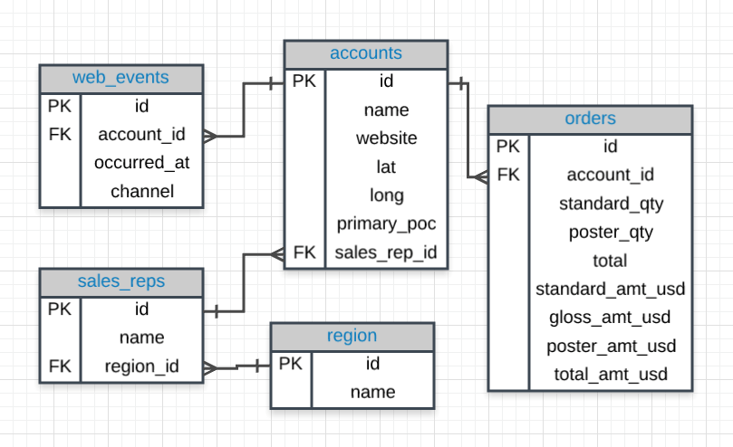
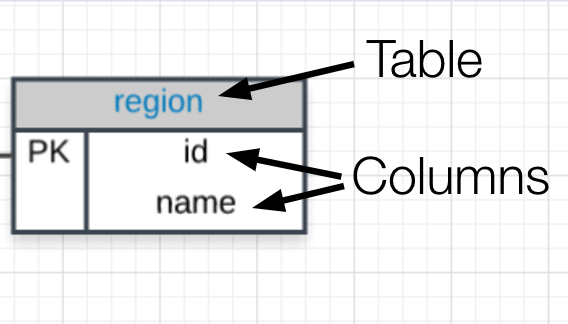

## 一.	ERD基础知识
实体关系图 (ERD) 是查看数据库中数据的常用方式。下面是我们将用于 Parch & Posey 数据库的 ERD。这些图可帮助你可视化正在分析的数据，包括:

1.	表的名称。
2.	每个表中的列。
3.	表配合工作的方式。

你可以将下面的每个框看作一个电子表格。



注意事项

在 Parch & Posey 数据库中，共有五个表（基本上是 5 个电子表格）:

1.	web_events
2.	accounts
3.	orders
4.	sales_reps
5.	region

你可以将每个表视为一个单独的电子表格。然后将每个电子表格中的列放在表名下面。例如，region 表有两列: id 和 name，而 web_events 表有四列。



将这些表格连接在一起的 ["crow's foot"](https://www.vertabelo.com/blog/technical-articles/crow-s-foot-notation) 表示法显示了一个表中的列与另一个表中的列之间的关联。在第一课中，你将学习使用 SQL 与单个表进行交互的基础知识。在下一节课中，你将进一步了解这些连接对于使用 SQL 和关系数据库的重要性。

### 1. 习题1：
基于上图和你掌握的ERD新知识，将每个**数据**与适当的**定义**匹配
A.primary_poc B.SQL C.Database D.ERD E.web_events
定义 | 术语
---|---
Parch&Posey数据库中的列名称. |  
Parch&Posey数据库中的表名称. | 
共享存储在计算机中的连接数据的表的集合. |
显示数据如何在数据库中构造的图表. |
允许我们访问存储在数据库中的数据语言. |

在接下来的三节课中，你将学习如何编写结构化查询语言 (SQL)，以在教室中与数据库进行交互。你无需下载任何软件，但仍然可以练习你的技能！

SQL 是一项极其热门的技能。有大量工作使用 SQL，在接下来的课程中，你将学习如何利用 SQL 来分析数据和回答商业问题。你在Lesson上学习的技能可以直接扩展到在Lesson外的其他环境中编写 SQL。对于这些课程结束时的项目，你将下载一个程序，使你可以在本地计算机上编写代码。然后，你将通过查询数据库，使用与一家音乐店铺相关联的数据来分析和回答商业问题。

这三节课旨在帮助你了解如何编写 SQL 查询。但是，另外还有一节关于高级 SQL 的课程也由讲师 Derek 教授！

此课程的三节课旨在介绍 SQL 的以下方面：

* SQL 基础知识 - 首先，你将在此了解 SQL 的工作原理，并学习 SQL 语言的基础知识。你将学习如何编写代码，并与我们之前在 Excel 中分析的表类似的表进行交互。具体来说，你将了解数据库、SQL 的基本语法，并编写你的第一个查询！

* SQL 连接 - 在本课中，你将见识 SQL 的实际功能。你将认识实体关系图 (ERD)，以及如何连接关系数据库中的多个表。连接表的功能是让公司采取这种方式来保存数据的真正动力所在。

* SQL 聚合 - 在最后一课中，你将学习 SQL 一些更高级的功能。你将能够汇总数据库中多个表中的数据。 

学完这三节课后，你将准备好挑战项目了。该项目旨在确保你掌握了这三方面的知识，但你还将看到本课程未涵盖的一些更高级的查询。这些只是为了向你介绍高级材料，但如果你无法理解这些资料，不要感到气馁 - 它们超出了课程的范围，不是通过项目的必备条件！

## 二.	SQL语句

### 1. 习题1

 在sql中可以将语句视为 (选择所有适合的语句):
- [ ] 一段编写正确的sql代码。
- [ ] 一种处理数据库中所存储数据的方式。
- [ ] 一句话。
- [ ] 一种读取数据库中所存储数据的方式。

### 2. 习题2

在下面的课程中，我们将重点学习哪种类型的查询？
A. DROP
B. CREATE
C. QUERY
D. SELECT
## 三. 你的第一个查询

SQL数据库的类型有很多，都用于不同的用途。在本课中，我们将使用 Postgres，这是一个流行的开源数据库，具有非常完整的分析函数库。

一些最受欢迎的数据库包括：:
1.	MySQL
2.	Access
3.	Oracle
4.	Microsoft SQL Server
5.	Postgres

你也可以在其他编程框架中编写 SQL，如 Python、Scala 和 HaDoop。

**细微差别**

这些 SQL 数据库中的每一个可能在语法和可用函数上存在细微差异 -- 例如，MySQL 中没有像 Postgres 中类似的可用于修改日期的函数。你在 Postgres 中看到的大部分直接适用于在其他框架中和数据库环境中使用 SQL。如需了解存在的差异，可查看文档。大多数 SQL 环境都有很好的在线文档，通过快速的 Google 搜索便可轻松访问。

[这里](https://www.digitalocean.com/community/tutorials/sqlite-vs-mysql-vs-postgresql-a-comparison-of-relational-database-management-systems) 的文章比较了三种最常见的 SQL 类型：SQLite、PostgreSQL 和 MySQL。尽管你在Lesson中使用的是 PostgreSQL，但在项目中你要使用 SQLite。

**再次说明**

一旦你学会了如何在一个环境中编写 SQL，这些基本大都是可以转移到其他环境的。
我们一次只能访问一个表，但在后面的课程中，我们将增加表的数量并在各个表之间进行聚合。

```SQL
SELECT *
FROM orders;
```

每个 SQL 查询至少有一个 SELECT 和 FROM 语句。 SELECT 语句用于放置要显示数据的列。FROM 语句用于放置要从中提取数据的表。

### 1. 习题1：尝试编写自己的查询，以便为 orders 表中的所有订单选择 id、account_id 和 occurred_at 列。

## 四. LIMIT练习

### 1. 规定查询格式

**大写**

你可能已经注意到，我们大写了 SELECT 和 FROM，而将表和列名称小写。这是一个常见的格式惯例。大写命令（SELECT、FROM），小写查询中的其他内容是常见做法。这使得查询更容易读取，这在编写更复杂的查询时更为重要。准备编写查询时，这是一个很好的习惯。

**表和变量名中不需要空格**

通常在列名中使用下划线，避免使用空格。 在 SQL 中使用空格有点麻烦。 在 Postgres 中，如果列或表名称中有空格，就需要使用双引号括住这些列/表名称（例如：FROM \"Table Name\"，而不是 FROM table_name）。在其他环境中，可能会使用方括号（例如：FROM [Table Name]）。

**在查询中使用空格**

**SQL 查询忽略空格**

因此可以根据需要在代码之间添加尽可能多的空格和空行，并且查询结果是相同的。我们来看下面这个查询
```SQL
SELECT account_id FROM orders
```

等价于这个查询:

```SQL
SELECT account_id
FROM orders
```
和这个查询（但是永远不要这样写）:
```SQL
SELECT              account_id

FROM               orders
```

**SQL 不区分大小写**

如果你已经使用过其他语言编程，那么可能会熟悉编程语言，如果没有区分大小写键入正确的字符，那么会非常麻烦。 SQL 不区分大小写。 我们来看看下面的查询：
```SQL
SELECT account_id
FROM orders
```
和这个相同：
```SQL
select account_id
from orders
```
也和这个相同：
```SQL
SeLeCt AcCoUnt_id
FrOm oRdErS
```

但是，我会再次提醒你遵循上面讲述的完全大写命令的惯例，而将其他代码片段小写。

**分号**

根据 SQL 环境，查询结尾可能需要一个执行的分号。 这个"要求"在其他环境中比较灵活。我们认为在每个语句的末尾添加一个分号是最好的做法，如果环境能够一次显示多个结果，那么这样做还可以一次运行多个命令。

最好的做法：
```SQL
SELECT account_id
FROM orders;
```
因为，我们这里的环境不需要分号，你会看到没有分号的解决方案：
```SQL
SELECT account_id
FROM orders
```

哇 !!! 规则太多了。我们只是编写了一些查询，然而仍然会犯错误，不过这也是一个学习的过程！


1. 习题1：编写一个查询，将响应限制在前 15 行，和包括 web_events 表中的 occurred_at、account_id 和 channel 字段，我们来试一下

五. ORDER BY练习

使用 ORDER BY 进行练习：

1. 编写查询，返回 orders 表的前 10 个订单。包含 id、occurred_at 和 total_amt_usd。 

2. 编写一个查询，基于 total_amt_usd 返回前 5 个最高的 订单 (orders 表)。包括 id、account_id 和 total_amt_usd。 

3. 编写一个查询，基于 total 返回前 20 个最低 订单 (orders 表)。包括 id、account_id和 total。 

4. 编写一个查询，返回按从最新到最早排序的 订单 中的前 5 行，但需首先列出每个日期的最大 total_amt_usd。 

5. 编写一个查询，返回按从最早到最新排序的 订单 中的前 10 行，但需首先列出每个日期的最小 total_amt_usd。 

## 六.	WHERE练习

我们可以基于必须满足的条件，使用 WHERE 语句来为表格创建子集。下面的视频介绍了如何使用这个语句，在接下来的课程中，我们将学习一些与 WHERE 语句一起使用的常见运算符。
WHERE 语句中使用的常用符号包括：

1.	\>（大于）
2.	<（小于）
3.	\>=（大于或等于）
4.	<=（小于或等于）
5.	=（等于）
6.	!=（不等于）

**练习**

1. 从 订单 表提取出大于或等于 1000 的 gloss_amt_usd 美元数额的前五行数据（包含所有列）。

2. 从 订单 表提取出小于 500 的 total_amt_usd美元数额的前十行数据（包含所有列）。

WHERE 语句也可以与非数字数据一起使用。在这节课中，我们可以使用 = 和 ！= 运算符。 还需要确保在文本数据中使用引号（单引号或双引号都可以 - 如果原始文本中有引号，就一定要注意）。

通常将 WHERE 与非数字数据字段一起使用时，我们会使用 LIKE、NOT 或 IN 运算符。我们将在本课结束之前具体讲解这些内容！

## 七.	算术运算符

**派生列**

我们将现有的列组合，生成的新列称为派生列。

常见运算包括：

1. *（乘法）
2. +（加法）
3. -（减法）
4. /（除法）

**运算顺序**

还记得数学课中介绍的 PEMDAS 吗？如果不记得了，请查看这个提醒 链接。在 SQL 中使用算术运算符时，可采用相同的运算顺序。

下面两个语句的最终结果差异很大：

1. Standard_qty / standard_qty + gloss_qty + poster_qty
2. standard_qty / (standard_qty + gloss_qty + poster_qty)

这与我们将在第 2 部分计算语句的情况很像。

## 八．LIKE练习

**逻辑运算符简介**

我们将在接下来的概念中学习 逻辑运算符。逻辑运算符包括：

1. LIKE：可用于进行类似于使用 WHERE 和 = 的运算，但是这用于你可能 不 知道自己想准确查找哪些内容的情况。

2. IN：用于执行类似于使用 WHERE 和 = 的运算，但用于多个条件的情况。

3. NOT：这与 IN 和 LIKE 一起使用，用于选择 NOT LIKE 或 NOT IN 某个条件的所有行。

4. AND & BETWEEN：可用于组合所有组合条件必须为真的运算。

5. OR：可用于组合至少一个组合条件必须为真的运算。

LIKE 运算符对于处理文本非常有用。我们将在 WHERE 子句中使用 LIKE。 LIKE 运算符经常与 ％ 一起使用。 ％ 告诉我们，我们可能会想要任何数量的字符，产生一组特定的字符或者遵循一组特定的字符，就像我们在之前学习的 google 语法一样。记住，需要用单引号或双引号将传达给 LIKE 运算符的文本括住，因为这个字符串中的大小写字母不一样。 搜索 'T' 与搜索 't' 不同。

随着我们向具有更多实用性的运算过渡，我希望你一开始就能顺利使用 SQL，但这也意味着我们无法向你一一举例说明。 希望你开始考虑如何使用这些类型的应用来识别特定区域的电话号码，或者你不能完全记住全名的某个区域。

**习题**

使用 accounts (客户) 表查找

1. 所有以 'C' 开头公司名。

2. 名称中包含字符串 'one' 的所有公司名。

3. 所有以 's' 结尾的公司名。

## 九．IN练习

IN 运算符对于数字和文本列都很有用。这个运算符可使我们使用 =，但对于特定列的多个项目。 可以检查我们要提取数据的一个、两个或多个列值，但这些都在同一个查询中。 在后面的概念中，我们将介绍 OR 运算符，也可以使用这个运算符执行这些任务，但使用 In 运算符编写的查询更清楚一些。

**专家提示**

从技术上讲，可以使用单引号或双引号 - 如果你尝试提取的文本中有一个单引号，就可能需要双引号来包围。注意：在教室的工作区中，你可以通过将两个单引号放在一起。 例如，Macy's 在我们的工作区显示为 Macy''s 。

**习题**

1. 使用 客户 表查找 Walmart、Target 和 Nordstrom 的name (客户名称), primary_poc (主要零售店), and sales_rep_id (销售代表 id)。

2. 使用 web_events 表查找有关通过 organic 或 adwords 联系的所有个人信息。

## 十. NOT练习

NOT 运算符是一个非常有用的运算符，用于与之前介绍的两个运算符 IN 和 LIKE 一起运算。通过指定 NOT LIKE 或 NOT IN，我们可以查找到所有不符合特定条件的行。

我们可以使用这个新运算符来提取前两个概念中不属于查询内容的所有行。

**习题**

1. 使用客户表查找除 Walmart、Target 和 Nordstrom 之外的所有商店的客户名称、主要零售店和销售代表 id。

2. 使用 web_events 表查找除通过任何方法联系的个人的所有信息，除了使用 organic 或 adwords 方法。
使用客户表查找：

3. 所有不以 'C' 开头的公司名。

4. 所有名称中不包含字符串 'one' 的公司名。 

5. 所有不以 's' 结尾的公司名。

## 十一. AND和BETWEEN练习

AND 运算符用于 WHERE 语句中，用于一次考虑多个逻辑子句。 使用 AND 连接一个新的语句时，需要指定你感兴趣的列。可以同时连接尽可能多的考虑语句。 这个运算符可用于我们迄今为止所学习到的所有运算，包括算术运算符（+、*、-、/），可以使用 AND 运算符将 LIKE、IN 和 NOT 逻辑连接到一起。

BETWEEN 运算符

有时使用 BETWEEN 比使用 AND 使语句更清楚一些。特别是在 AND 语句的不同部分使用相同的列时，就可以使语句比较清晰。 在上一个视频中，我们可能已经使用了 BETWEEN。

而不是编写：

```SQL
WHERE column >= 6 AND column <= 10
```

编写成以下这样，或许会更好:

```SQL
WHERE column BETWEEN 6 AND 10
```

**习题**

1. 编写一个查询，返回所有订单，其中 standard_qty 超过 1000，poster_qty 是 0，gloss_qty 也是 0。

2. 使用客户表查找所有不以 'C' 开始但以 's' 结尾的公司名。 

3. 使用 web_events 表查找通过 organic 或 adwords 联系，并在 2016 年的任何时间开通帐户的个人全部信息，并按照从最新到最旧的顺序排列。

## 十二. OR练习

与 AND 运算符类似，OR 运算符可以组合多个语句。 使用 OR 连接新的语句时，需要指定你感兴趣的列。可以同时连接尽可能多的考虑语句。 这个运算符可用于我们迄今为止所学习到的所有运算，包括算术运算符（+、*、-、/），可以使用 OR 运算符将 LIKE、IN、NOT、AND 和 BETWEEN逻辑连接到一起。

将多个运算组合到一起时，可能经常需要使用括号来确保我们要执行的逻辑能得到正确执行。下面的视频给出了这些情况的其中一个示例。

**习题**

1. 查找 订单 (orders) id 的列表，其中 gloss_qty 或 poster_qty 大于 4000。只在结果表中包含 id 字段。

2. 编写一个查询，返回订单 (orders) 的列表，其中标准数量 (standard_qty)为零，光泽度 (gloss_qty) 或海报数量 (poster_qty)超过 1000。

3. 查找以 'C' 或 'W' 开头的所有公司名 (company names)，主要联系人 (primary contact) 包含 'ana' 或 'Ana'，但不包含 'eana'。

## 总结

命令
你已经学到了关于在 SQL 中编写代码的很多东西！在继续后面的内容之前，让我们花一点时间来概括一下我们所讲的内容：

| 语句      | 用法 | 其他详情 |
| ----------- | ----------- | ----------- |
| SELECT|   SELECT Col1, Col2, ...   |     提供你想要的列   |
| FROM|   FROM Table   |     提供列存在的表   |
| LIMIT|   LIMIT 10   |     限制返回的行数   |
| ORDER BY|   ORDER BY Col   |     根据列对表排序。与 DESC 一起使用。   |
| WHERE|   WHERE Col > 5   |     用于过滤结果的条件语句   |
| LIKE|   WHERE Col LIKE '%me%   |     仅拉取文本中包含 'me' 的列   |
| IN|   WHERE Col IN ('Y', 'N')   |     仅过滤包含 'Y' 或 'N' 列的行   |
| NOT|   WHERE Col NOT IN ('Y', "N')   |     NOT 经常与 LIKE 和 IN 一起使用   |
| AND|   WHERE Col1 > 5 AND Col2 < 3.   |     过滤两个或多个条件必须为真的行   |
| OR|   WHERE Col1 > 5 OR Col2 < 3   |     过滤至少一个条件必须为真的行   |
| BETWEEN|   WHERE Col BETWEEN 3 AND 5   |     通常比使用 AND 的语法简单   |
		

**其他提示**

尽管 SQL 不区分大小写（它不在乎你将语句全部大写还是小写），但我们讨论了一些最佳实践。关键词的顺序非常重要：
```SQL
SELECT col1, col2
FROM table1
WHERE col3  > 5 AND col4 LIKE '%os%'
ORDER BY col5
LIMIT 10;
```

注意，你可以检索不同于 ORDER BY 和 WHERE 语句中所使用列的列。假定这些列名均以这样的方式（col1、col2、col3、col4、col5）存在于一个名为 table1 的表中，此查询便会很好地运行。

**后续内容**

下节课中，你将学习JOIN（连接）。这是 SQL 作为一门语言能如此成功的秘诀所在（这一点早已不是秘密）。JOIN 使我们可以将多个表组合在一起。我们在此所学的所有运算对于后面的内容仍然重要，但通过将多个表的信息结合在一起，我们将能回答更复杂的问题！你已经掌握了很多内容，或许也编写了你人生的第一份代码，不过之后你还可以有更多的提升空间！
