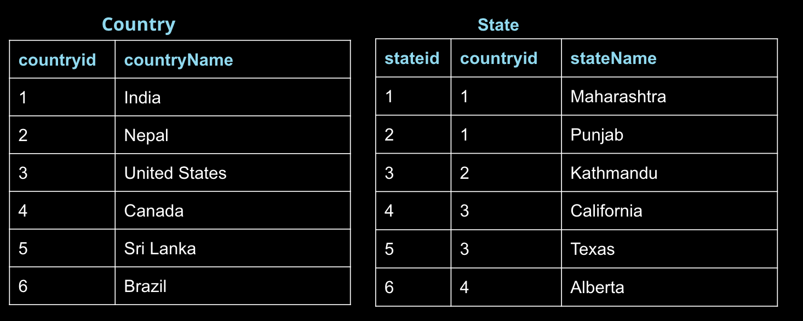

## 数据库规范化

在创建数据库时，一定要思考下将如何存储数据。这称为规范化，是大多数 SQL 课程的一个重要组成部分。如果你负责设置新的数据库，则需要详细了解数据库规范化。

数据库规范化需要考虑以下三个要点：

1. 表格存储了逻辑分组的数据吗？
2. 我能在一个位置进行更改，而不是在多个表格中对同一信息作出更改吗？
3. 我能快速高效地访问和操纵数据吗？

[这篇文章](http://sqlmag.com/database-performance-tuning/sql-design-why-you-need-database-normalization)详细讲解了上述内容。

但是，大多数分析师处理的数据库已经设置了必要的属性。作为数据分析师，你不需要太思考数据规范化。你只需能够从数据库中获取数据，从而能够绘制图表。这将是这节课的侧重点。

整个这节课将讲解 JOIN。JOIN 语句的整个目标是一次能够从多个表格中获取数据。JOIN 使我们能够从多个表格中获取数据。是既简单，又很强大的功能。在掌握了 JOIN 语句后，我们还将学习 ON 语句。

## 一. 编写你的首个 JOIN

以下是一个 JOIN 语句，你将有很多实践机会，没有什么学习方法比实践更强了。你将发现，我们在普通查询中引入了两个新的部分：JOIN 和 ON。JOIN 指定了你要从中获取数据的第二个表格。ON 表示你想如何合并 FROM 和 JOIN 语句中的表格。

```SQL
SELECT orders.*
FROM orders
JOIN accounts
ON orders.account_id = accounts.id;
```

尝试自己运行上面的查询。

### 1. 要注意什么

我们能够从两个表格中获取数据：

1. orders
2. accounts

我们仅从 orders 表格中获取数据。

ON 语句存储的是两个表格中相连的两列。下个部分将重点讲解这一概念。

### 2. 练习问题

1. 尝试获取 accounts 表格中的所有数据，以及 orders 表格中的所有数据。

2. 尝试从 orders 表格中获取 standard_qty、gloss_qty 和 poster_qty，并从 accounts 表格中获取 website 和 primary_poc。

## 实体关系图

你可能还记得，在上节课，我们提到实体关系图 (ERD) 是查看数据库中数据的常见方式。它也是了解如何从多个表格中获取数据的关键要素。

如果能知道 Parch & Posey handy 的 ERD 看起来怎样，会比较有帮助，因此我在下面再次提供了该图。你甚至可以打印一份，这样在完成剩下的练习时可以参考。


## 表格与列

在 Parch & Posey 数据库中，有 5 个表格

1. web_events
2. accounts
3. orders
4. sales_reps
5. region

你将发现，表格中某些列的列名称旁边具有 PK 或 FK，而其他列根本没有标签。

如果你再仔细观察，可能会发现，PK 在每个表格中与第一列相关。PK 表示主键。每个表格都存在主键，它是每行的值都唯一的列。

如果你查看我们的数据库中每个表格的前几行，你会发现这个首个 PK 列始终是唯一的。对于此数据库，它始终称为 id，但并非所有数据库都这样。

## 键

### 主键 (PK)

主键是特定表格的唯一列。在我们的每个表格中是第一列，并且这些列都叫做 id，但是并非必须都要这样。通常，在大多数数据库中，主键是表格的第一列。

### 外键 (FK)

外键是另一个表格中的主键。我们可以在上一个 ERD 中看到，外键如下所示：

1. region_id
2. account_id
3. sales_rep_id

每个都与另一个表格的主键相关。下图是一个示例：


### 主键 - 外键关联性

在上图中，可以看出：

1. region_id 是外键。
2. region_id 与 id 相连 - 它是将这两个表格相连的主外键关系。
3. Crow's foot（鱼尾纹） 表示 FK 实际上可以出现在 sales_reps 表格中的很多行中。
4. 虽然这一行告诉我们 PK 显示在此表格中 id 每行仅出现一次。

如果你查看该数据库的其他部分，你会发现，主外键关系始终是这种情况。在下个页面中，你可以完全掌握这一知识点！

## 二. 练习：主外键关系

1. 
习题1/3
A. 将每个术语或列匹配到相应的定义或说明。
B. ON accounts.account_id = web_events.id
C. ON web_events.id = accounts.id
D. ON accounts.id = web_events.id
E. 主键
F. 外键
G. id
H. account_id
I. ON web_events.account_id = accounts.id
定义或列描述 |术语或列
--|--
让该列中的每行都具有唯一值。每个表格中都有一个 | 
存在于另一个表格中的主键关联性 |  
每个表格中的主键 |
同时存在于web_events 和 orders 表格中的外键。 |
ON 语句使join的表web_events 和 accounts 产生关联 |
2. 
习题2/3 选择所有关于主键的正确描述
- [ ] 每个表格中都必须有一个（且只有一个）这种列
- [ ] 他们是表格中的一列
- [ ] 表格中可能有多个主键
- [ ] 他们是表格中的一行
- [ ] 在整个数据库中，每个数据库只有一个主键
3. 
选择所有关于外键的正确描述。
- [ ] 他们始终与主键相关联
- [ ] 对于表格中的每行，他们是唯一的。
- [ ] 每个表格都必须具有一个外键
- [ ] 表格中只有一个外键
- [ ] 在上述数据库中，每个文件都与鱼尾纹技法相关，表明它可以在表格中的一列里出现多次


## 三. 练习：JOIN 回顾

我们回顾下你编写的第一个 JOIN 语句。

```SQL
SELECT orders.*
FROM orders
JOIN accounts
ON orders.account_id = accounts.id;
```

以下是这两个表格的 ERD：


**注意**

注意，我们的 SQL 查询包含两个想要连接的表格：一个来自 FROM，另一个来自 JOIN。然后在 ON 中，我们始终让主键等于外键：

我们按照以下方式连接任何两个表格。


1. 
参考以上图片。如果我们想连接sales_reps和region表格，如何操作？
A. ON sales_reps.id = region.id
B. ON sales_reps.id = region.name
C. ON sales_reps.region_id = region.id
D. ON region.id = sales_reps.id

**连接多个表格**

可以利用同一逻辑连接多个表格。看看下面的三个表格。


**代码**

如果我们想连接所有这三个表格，我们可以采用相同的逻辑。

```SQL
FROM web_events
JOIN accounts
ON web_events.account_id = accounts.id
JOIN orders
ON accounts.id = orders.account_id
```

现在，我们的 SELECT 语句可以从所有三个表格中获取数据。同样，JOIN 存储的是表格，ON 是让主键等于外键。

SELECT 语句将需要指定你想从中获取列的表格：

```SQL
SELECT web_events.channel, accounts.name, orders.total
```

我们可以继续按照这一流程操作，连接所有要连接的表格。为了提高效率，我们可能不希望这么做，除非需要从所有表格中获取信息。

## 别名

当我们连接表格时，最好能为每个表格设置一个别名。你实际上在算术运算符部分见过类似的列名称别名。

示例：

```SQL
FROM tablename AS t1
JOIN tablename2 AS t2
```

之前，你见过如下所示的语句：

```SQL
SELECT col1 + col2 AS total, col3
```

经常你可能还会见到没有 AS 部分的语句。上述每个语句都可以改写为以下形式，结果依然相同：

```SQL
FROM tablename t1
JOIN tablename2 t2
```

以及

```SQL
SELECT col1 + col2 total, col3
```

## 四. 练习：JOIN问题

你已经了解了 JOIN，我们接下来通过练习让你熟练掌握这一新的知识点。我在下面提供了 ERD 和好几个问题。如果你遇到问题，或想对比检查答案，可以在下一页面找到这些问题的答案！


### 问题

1. 为与客户名称 Walmart 相关的所有 web_events 创建一个表格。表格应该包含三列：primary_poc、事件时间和每个事件的渠道。此外，你可以选择添加第四列，确保仅选中了 Walmart 事件。

2. 为每个 sales_rep（销售代表）对应的 region（区域）以及相关的 accounts（客户）创建一个表格，最终表格应该包含三列：区域 name（名称）、销售代表 name（名称），以及客户 name（名称）。根据客户名称按字母顺序 (A-Z) 排序。

3. 提供每个 order（订单）的每个区域 name（名称），以及客户 name（名称）和订单的 unit price（单价） (total_amt_usd/total)。最终表格应该包含三列：region name（区域名称）、account name（客户名称）和 unit price（单价）。少数几个客户的总订单数为 0，因此我除以的是 (total + 0.01) 以确保没有除以 0。

4. 
习题1/2  
标出以下所有的正确的表述
- [ ] ON语句应该始终让外键等于主键
- [ ] SQL要求ON语句始终让外键等于主键
- [ ] JOIN 语句使我们能够从SQL数据库中的多个表格里获取数据。
- [ ] 你可以将第一节课学到的所有命令与JOIN语句一起使用
- [ ] 从多个表格中获取数据的唯一方式是使用JOIN语句。
5. 
习题2/2 选择以下所有表述的正确的语句。
- [ ] 如果我们想要为表格设定别名，则必须在查询中使用AS。
- [ ] 如果我们想要为列设定别名，则必须在查询中使用AS。
- [ ] 当我们开始连接多个表格时，别名可以用来缩短表格名称，并且很常用。


## 五. 其他JOIN的目的

**专家提示**

当我们介绍主键和外键时，稍微介绍了这些一对一和一对多关系。注意，传统数据库不允许出现多对多关系，因为这样很快就会破坏架构。[这篇文章](https://stackoverflow.com/questions/7339143/why-no-many-to-many-relationships)给出了很好的解释。

数据库中的关系类型对分析师来说并不太重要，但是你需要了解为何要执行不同类型的 JOIN，以及你要从数据库中获取什么数据。我们将在下一部分详细讲解。

如果连接的表格没有匹配的信息，那么就会出现单元格为空的列。这些空的单元格就引出了新的数据类型，叫做 NULL。你将在下节课详细学习 NULL，暂时先理解为任何没有数据的单元格都是 NULL。

**JOIN 简介**

INNER JOIN：注意，到目前为止介绍的每个 JOIN 都是 INNER JOIN，即我们仅获取在两个表格中都匹配存在的行。

新的 JOIN 使我们能够获取可能仅在其中一个表格中存在的行。这就会导致一种新的数据类型，叫做 NULL。我们将在下节课详细讲解这一数据类型。

**注意**

你可能见过以下 SQL 语法

```SQL
LEFT OUTER JOIN
```

或

```SQL
RIGHT OUTER JOIN
```

这些命令和我们在上个视频中学过的 LEFT JOIN 和 RIGHT JOIN 完全一样。

**OUTER JOIN**

最后一种连接类型是外连接，它将返回内连接的结果，以及被连接的表格中没有匹配的行。

这种连接返回的是与两个表格中的某个表格不匹配的行，完整的外连接用例非常罕见。

你可以在[此处](https://stackoverflow.com/questions/2094793/when-is-a-good-situation-to-use-a-full-outer-join)查看外连接示例，并在[此处](https://www.w3resource.com/sql/joins/perform-a-full-outer-join.php)查看罕见使用情况说明。由于这种连接的使用情况很少见，因此我们将不消费时间讨论了。

和上面的相似，你可能还会看到 FULL OUTER JOIN，它和 OUTER JOIN 一样。

1. 
选择以下所有表述正确的语句。
- [ ] 如果我们更改FROM和JOIN语句中的表格，则LEFT JOIN 和 RIGHT JOIN的结果一样。
- [ ] LEFT JOIN 将**至少**返回所有 INNER JOIN返回的所有行。
- [ ] JOIN和INNER JOIN 是一样的。
- [ ] LEFT OUTER JOIN 和 LEFT JOIN 是一样的。

2. 


以上是两个小的表格，用来检测下你的 JOIN 知识。你可以点击图片，看的更清楚。

Country 有 6 行和 2 列：countryid 和 countryName

State 有 6 行和 3 列：stateid、countryid 和 stateName

根据上述表格判断以下问题的答案。

习题2/4
将每个语句与所描述的项相匹配
A. State.stateName B. Country.countryName C.Country.countryid D.State.stateid E.State.countryid
描述 | 项
-- | -- 
Country表格的主键 |
State表格的主键 |
在连接表格时会用到的外键 |

3.


上面的两个表格只是为了避免滚动幅度太大，如果你要执行以下查询：

```SQL
SELECT c.countryid, c.countryName, s.stateName
FROM Country c
JOIN State s
ON c.countryid = s.countryid;
```
将查询结果与说明相匹配
1 | 12 | 5 | 8 | 4 | 7 | 3 | 6 | 2 | 0
--| -- | -- | -- | -- |--| -- | -- | -- | --

描述 | 结果
-- | -- 
生成表格中的列数 |
生产表格中的行数 |
countryid 1 将在生成的表格中出现的次数|
countryid 6 将在生成的表格中出现的次数|


4.


上面的两个表格同样只是为了避免滚动幅度太大，如果你要执行以下查询：

```SQL
SELECT c.countryid, c.countryName, s.stateName
FROM Country c
LEFT JOIN State s
ON c.countryid = s.countryid;
```


## 六. 最后的检测


### 问题

1. 为每个销售代表对应的区域以及相关的客户创建一个表格，这次仅针对 Midwest 区域。最终表格应该包含三列：区域名称、销售代表姓名，以及客户名称。根据客户名称按字母顺序 (A-Z) 排序。

2. 为每个销售代表对应的区域以及相关的客户创建一个表格，这次仅针对 Midwest 区域，并且销售代表的名字以 S 开头。最终表格应该包含三列：区域名称、销售代表姓名，以及客户名称。根据客户名称按字母顺序 (A-Z) 排序。

3. 为每个销售代表对应的区域以及相关的客户创建一个表格，这次仅针对 Midwest 区域，并且销售代表的姓以 K 开头。最终表格应该包含三列：区域名称、销售代表姓名，以及客户名称。根据客户名称按字母顺序 (A-Z) 排序。

4. 提供每个订单的每个区域的名称，以及客户名称和所支付的单价 (total_amt_usd/total)。但是，只针对标准订单数量超过 100 的情况提供结果。最终表格应该包含三列：区域名称、客户名称和单价。为了避免除以 0 个订单，这里可以在分母上加上 0.01，即：(total_amt_usd/(total+0.01))。

5. 提供每个订单的每个区域的名称，以及客户名称和所支付的单价 (total_amt_usd/total)。但是，只针对标准订单数量超过 100 且广告纸数量超过 50 的情况提供结果。最终表格应该包含三列：区域名称、客户名称和单价。按照最低的单价在最之前排序。为了避免除以 0 个订单，这里可以在分母上加上 0.01，即：(total_amt_usd/(total+0.01))。

6. 提供每个订单的每个区域的名称，以及客户名称和所支付的单价 (total_amt_usd/total)。但是，只针对标准订单数量超过 100 且广告纸数量超过 50 的情况提供结果。最终表格应该包含三列：区域名称、客户名称和单价。按照最高的单价在最之前排序。为了避免除以 0 个订单，这里可以在分母上加上 0.01，即：(total_amt_usd/(total+0.01))。

7. account id 为 1001 的客户使用了哪些不同的渠道。最终表格应该包含 2 列：客户名称和不同的渠道。你可以尝试使用 SELECT DISTINCT 使结果仅显示唯一的值。

8. 找出发生在 2015 年的所有订单。最终表格应该包含 4 列：occurred_at、account name、order total 和 order total_amt_usd。

## 总结

### 主键和外键

你学习了在连接数据库中的表格时与主键和外键相关的关键要素：

* 主键 - 对于表格中的每行都是唯一的。主键通常是数据库中的第一列（就像 Parch & Posey 数据库中每个表格的 id 列）。

* 外键 - 是出现在另一个表格中的主键，允许行不是唯一的行。

数据库的数据设置非常重要，但通常不是数据分析师的职责。这一过程称为数据库规范化。

### JOIN

在这节课，你学习了如何使用 JOIN 组合多个表格的数据。你将最常用到的三个 JOIN 语句为：

1. JOIN - 一种 INNER JOIN，仅获取在两个表格中都存在的数据。
2. LEFT JOIN - 用于获取 FROM 中的表格中的所有行，即使它们不存在于 JOIN 语句中。
3. RIGHT JOIN - 用于获取 JOIN 中的表格中的所有行，即使它们不存在于 FROM 语句中。

还有几个没有讲解的高级 JOIN，它们仅适用于非常特定的情况。[UNION 和 UNION ALL](http://www.sqlservertutorial.net/sql-server-basics/sql-server-union/)、[CROSS JOIN](http://www.sqlservertutorial.net/sql-server-basics/sql-server-cross-join/) 和比较难的 [SELF JOIN](http://www.sqlservertutorial.net/sql-server-basics/sql-server-self-join/)。这些内容比较深奥，这门课程不会再过多介绍，但是有必要知道这些连接方法是存在的，它们在特殊情况下比较实用。

### 别名

你学习了可以使用 AS 或直接对表格和列设定别名。这样可以减少要输入的字符数，同时确保列标题可以描述表格中的数据。

### 后续内容

下节课的主题是聚合数据。你已经学到了很多知识，但是可能依然觉得 SQL 与统计学和使用 Excel 等平台不太相关。聚合函数将使你能够编写更复杂的 SQL 查询，并回答以下等问题：

1. 哪个渠道产生的收入更高？
2. 哪个客户具有商品量最多的订单？
3. 哪个销售代表的订单量最多？或订单量最少？他们有多少订单？